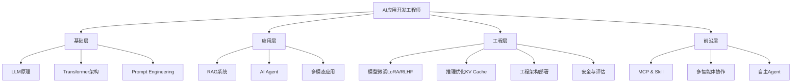

<div align="center">

# 🚀 AI 应用开发工程师面试宝典

> **⚠️ 本次更新(v3.111)：新增 τ-bench Agent评估基准(Q32) + 2026年Berkeley基准测试exploit问题**

**🎯 385+ 道高频面试题 | 24 个核心模块 | 从基础到进阶系统化学习**

[](https://opensource.org/licenses/MIT)
[](https://github.com/guocong-bincai/ai-interview-guide)
[](https://github.com/guocong-bincai/ai-interview-guide)
[](https://github.com/guocong-bincai/ai-interview-guide)
[](https://github.com/guocong-bincai/ai-interview-guide/pulls)

**适用岗位:** AI应用工程师 · LLM工程师 · AI Agent开发 · RAG系统开发
**版本:** v3.111 | **最后更新:** 2026-05-12"""

[📖 开始学习](#-学习路线) · [🔥 高频题库](#-核心面试题按难度分级) · [💡 实战案例](#-实战案例) · [🤝 贡献指南](#-贡献指南)

</div>

---

## 📖 项目简介

> 一个**系统化、实战化、面试友好**的 AI 应用开发工程师学习资源，涵盖从 LLM 基础到生产部署的完整技术栈。

### 🌟 核心特色

- **📚 系统化学习路径** - 24个模块从易到难，341+道题覆盖完整知识体系
- **🎯 高频题优先** - 基于真实面试数据，按出现频率排序
- **💡 实战导向** - 每道题配有生产级代码示例和性能优化方案
- **🔥 紧跟前沿** - Transformer架构、多模态、推理优化等2026热点技术
- **✅ 面试友好** - 包含"面试话术"模板和速记卡片，可直接背诵

### 📊 内容概览

| 维度 | 数据 |
|------|------|
| 📝 **总题数** | 346+ 道 |
| 📂 **核心模块** | 20 个 |
| 💻 **代码示例** | 90+ 个 |
| 📈 **难度分布** | ⭐⭐ ~ ⭐⭐⭐⭐⭐ |
| 🎓 **适用人群** | 初级 ~ 高级工程师 |

---

## 📚 目录

## 🔥 核心面试题（按难度分级）

### 🟢 Level 1: 基础必备（适合 0-1 年经验）

> 掌握这些是进入 AI 应用开发领域的门槛

| 序号 | 模块 | 核心内容 | 高频度 | 题数 |
|------|------|----------|--------|------|
| 01 | [📌 LLM 基础概念](docs/01-basic-concepts/) | Token、Temperature、Context Window、长文本处理 | 🔥🔥🔥🔥🔥 | 15 |
| 02 | [✍️ Prompt Engineering](docs/02-prompt-engineering/) | CoT、Self-Consistency、ToT、结构化输出、Temperature调参实战 | 🔥🔥🔥🔥🔥 | 13 |

**学习重点:** LLM工作原理、基本调参、提示词工程
**预计时间:** 1-2周

---

### 🟡 Level 2: 应用开发（适合 1-2 年经验）

> 能够独立开发 RAG 系统和简单 Agent

| 序号 | 模块 | 核心内容 | 高频度 | 题数 |
|------|------|----------|--------|------|
| 03 | [📚 RAG 系统](docs/03-rag-system/) | RAG流程、GraphRAG知识图谱、Agentic RAG多跳推理、幻觉解决 | 🔥🔥🔥🔥🔥 | 17 |
| 04 | [💼 项目实战经验](docs/04-project-experience/) | **RAG/Agent项目、成本优化、冷启动、STAR法则** | 🔥🔥🔥🔥🔥 | 5 |
| 05 | [🏗️ Transformer架构](docs/05-transformer-architecture/) | Self-Attention、Multi-Head、BERT vs GPT、Q K V计算 | 🔥🔥🔥🔥 | 9 |
| 06 | [🤖 AI Agent基础](docs/05-ai-agent-basics/) | ReAct、记忆/规划、Human-in-the-Loop、AAR自动对齐研究、Trustworthy Agent框架 | 🔥🔥🔥🔥🔥 | 21 |

**学习重点:** RAG完整流程、项目经验总结、向量检索、Agent基本模式
**预计时间:** 2-3周

---

### 🟠 Level 3: 工程优化（适合 2-3 年经验）

> 能够优化系统性能、降低成本、保证质量

| 序号 | 模块 | 核心内容 | 高频度 | 题数 |
|------|------|----------|--------|------|
| 07 | [⚙️ 向量索引优化](docs/07-vector-index-optimization/) | HNSW、IVF、混合检索、RRF融合、两阶段Rerank、ColBERT、HNSW调参 | 🔥🔥🔥🔥 | 11 |
| 08 | [🎓 模型微调与训练](docs/07-model-training/) | LoRA、RLHF、DPO、TRL v1.0、微调策略 | 🔥🔥🔥🔥 | 14 |
| 09 | [⚡ 推理优化](docs/09-inference-optimization/) | KV Cache、量化、投机采样、Continuous Batching、vLLM | 🔥🔥🔥🔥🔥 | 13 |
| 10 | [🛡️ AI 安全与评估](docs/10-ai-safety-evaluation/) | 幻觉缓解、Prompt注入防御、评估指标、RAGAS | 🔥🔥🔥🔥🔥 | 14 |

**学习重点:** 性能优化、成本控制、质量保障、安全防护
**预计时间:** 3-4周

---

### 🔴 Level 4: 架构设计（适合 3+ 年经验）

> 能够设计复杂系统、处理生产问题

| 序号 | 模块 | 核心内容 | 高频度 | 题数 |
|------|------|----------|--------|------|
| 10 | [🏛️ 工程架构与部署](docs/10-production-deployment/) | 流式输出、缓存、监控、MLOps、CI/CD | 🔥🔥🔥🔥🔥 | 14 |
| 11 | [🎨 多模态应用](docs/11-multimodal-ai/) | CLIP、BLIP、LLaVA、图文检索、生图Agent、Gemma 4、端侧部署 | 🔥🔥🔥 | 14 |
| 12 | [🔧 框架与工具](docs/12-frameworks-tools/) | LangChain、Coze、Dify、Function Calling、Streaming | 🔥🔥🔥🔥🔥 | 12 |

**学习重点:** 系统架构、生产部署、多模态集成
**预计时间:** 4-5周

---

### 🟣 Level 5: 前沿技术（适合资深工程师）

> 掌握最新技术、引领团队创新

| 序号 | 模块 | 核心内容 | 高频度 | 题数 |
|------|------|----------|--------|------|
| 15 | [🎯 多智能体协作](docs/13-multi-agent-systems/) | AutoGen、CrewAI、Agent通信、任务编排 | 🔥🔥🔥🔥 | 10 |
| 14 | [🔌 MCP & Skill系统](docs/14-mcp-skill-systems/) | MCP协议、Server开发、Client集成、Sequential Thinking/Memory新Server、企业级部署 | 🔥🔥🔥🔥 | 29 |
| 16 | [🚀 前沿技术与趋势](docs/16-advanced-topics/) | 自主Agent、产品思维、调试优化 | 🔥🔥🔥 | 10 |
| 17 | [🔥 AI 编程工具与 Coding Agent](docs/17-ai-coding-tools/) | AI 编程工具对比、自主 Coding Agent、GenericAgent自进化技能树、SWE-bench | 🔥🔥🔥 | 38 |
| 24 | [🐍 Python 工程基础](docs/24-python-engineering/) | asyncio、FastAPI SSE、Pydantic v2、重试机制、多进程、pytest测试、内存管理 | 🔥🔥🔥 | 7 |
| 25 | [🏗️ AI 系统设计](docs/25-system-design-ai/) | 大厂高频系统设计题：AI客服/RAG平台/LLM网关/任务队列/内容审核 | 🔥🔥🔥🔥🔥 | 5 |

**学习重点:** 前沿技术、系统创新、团队领导
**预计时间:** 持续学习

---

### 📄 附录与特色模块

| 序号 | 模块 | 内容 | 高频度 | 题数 |
|------|------|------|--------|------|
| 18 | [📝 简历与面试技巧](docs/18-resume-interview-tips/) | 简历模板、面试技巧、常见问题 | 🔥🔥🔥 | - |
| 19 | [🏢 国内大厂真题集](docs/19-big-tech-interview-questions/) | **字节/阿里/美团/百度真实面经** | 🔥🔥🔥🔥🔥 | 10+ |

**高频度说明:**
🔥🔥🔥🔥🔥 = 90%+ 面试会问
🔥🔥🔥🔥 = 70%+ 面试会问
🔥🔥🔥 = 50%+ 面试会问

---

## 📖 学习路线

### 🎯 按岗位分类

<details>
<summary><b>🔹 RAG 系统工程师</b>（点击展开）</summary>

**必学路径:**
```
01.LLM基础 → 03.RAG系统 → 06.向量索引优化 → 09.AI安全与评估
```

**推荐路径:**
```
+ 02.Prompt Engineering
+ 08.推理优化
+ 10.工程架构与部署
```

**学习时间:** 6-8周
**核心技能:** 向量检索、Embedding、混合检索、Rerank

</details>

<details>
<summary><b>🔹 AI Agent 工程师</b>（点击展开）</summary>

**必学路径:**
```
01.LLM基础 → 02.Prompt → 05.AI Agent → 13.多智能体协作
```

**推荐路径:**
```
+ 03.RAG系统（知识库集成）
+ 14.MCP & Skill系统
+ 15.前沿技术与趋势
```

**学习时间:** 6-8周
**核心技能:** ReAct、Function Calling、多Agent协作、规划推理

</details>

<details>
<summary><b>🔹 LLM 应用工程师</b>（点击展开）</summary>

**必学路径:**
```
01.LLM基础 → 04.Transformer → 07.模型微调 → 08.推理优化
```

**推荐路径:**
```
+ 03.RAG系统
+ 10.工程架构与部署
+ 11.多模态应用
```

**学习时间:** 8-10周
**核心技能:** LoRA微调、RLHF对齐、推理优化、模型部署

</details>

### ⏱️ 按时间分类

<details>
<summary><b>📅 1周冲刺</b>（核心20题）</summary>

**Day 1-2:** LLM基础 (5题) + Prompt (3题)
**Day 3-4:** RAG系统 (5题) + Agent (3题)
**Day 5-6:** 高频题复习 + 速记卡片
**Day 7:** 模拟面试练习

</details>

<details>
<summary><b>📅 2周充分准备</b>（核心50题）</summary>

**Week 1:**
- LLM基础 + Prompt + RAG (25题)
- 每天4-5题，理解+记忆

**Week 2:**
- Agent + 微调 + 推理 (25题)
- 模拟面试 + 实战演练

</details>

<details>
<summary><b>📅 1月系统学习</b>（全部140+题）</summary>

**Week 1:** Level 1 基础必备 (22题)
**Week 2:** Level 2 应用开发 (25题)
**Week 3:** Level 3 工程优化 (39题)
**Week 4:** Level 4-5 架构设计 + 前沿技术 (51题)
**每周末:** 复习 + 刷题 + 模拟面试

</details>

---

## 💡 实战案例

> 真实项目经验，从问题到解决方案的完整复盘

### 🏆 高分案例

| 案例 | 挑战 | 解决方案 | 效果 |
|------|------|----------|------|
| [📄 复杂PDF解析](cases/pdf-parsing.md) | 跨页表格、OCR噪声 | Layout-Parser + GPT-4V | 准确率 65% → 94% |
| [💰 成本优化](cases/cost-optimization.md) | Token消耗过高 | 语义缓存 + 模型路由 | 成本降低 60% |
| [🚀 生产部署](cases/production-deployment.md) | 并发卡顿、流式中断 | Continuous Batching + 连接池 | 200 QPS 稳定 |
| [🔍 检索优化](cases/retrieval-optimization.md) | 召回率低 | 混合检索 + Rerank | Recall@5: 65% → 85% |

### 📊 技术栈对比

| 技术选型 | 适用场景 | 优势 | 劣势 |
|----------|----------|------|------|
| **RAG vs 微调** | 知识库问答 vs 风格定制 | RAG可更新、有溯源 | 微调效果更好 |
| **Milvus vs Pinecone** | 自部署 vs 云服务 | Milvus开源免费 | Pinecone易用 |
| **GPT-4 vs Claude** | 复杂推理 vs 长文本 | GPT-4能力强 | Claude上下文大 |

---

## 📊 技术栈全景图



---

## 🚀 快速开始

### 1️⃣ 选择学习路径

```bash
# 克隆仓库
git clone https://github.com/guocong-bincai/ai-interview-guide.git
cd ai-interview-guide

# 根据岗位选择模块
# RAG工程师: 01 → 03 → 06 → 09
# Agent工程师: 01 → 02 → 05 → 13
# LLM工程师: 01 → 04 → 07 → 08
```

### 2️⃣ 每日学习计划

- **周一至周五:** 每天2-3道题，深度理解原理
- **周末:** 复习速记卡片，模拟面试练习
- **每周总结:** 整理笔记，建立知识网络

### 3️⃣ 学习技巧

- ✅ 先看问题，自己思考3分钟
- ✅ 对比答案，理解核心概念
- ✅ 背诵"面试话术"和速记卡片
- ✅ 运行代码示例，加深理解
- ✅ 结合项目，实战应用

---

## 📦 仓库结构

```
ai-interview-guide/
├── README.md
└── 📂 docs/                    # 23个核心模块（按难度排序）
    ├── 01-basic-concepts/           # ⭐⭐ LLM基础
    ├── 02-prompt-engineering/       # ⭐⭐ Prompt工程
    ├── 03-rag-system/               # ⭐⭐⭐ RAG系统
    ├── 04-transformer-architecture/ # ⭐⭐⭐⭐ Transformer架构
    ├── 05-ai-agent-basics/          # ⭐⭐⭐⭐ Agent基础
    ├── 06-vector-index-optimization/# ⭐⭐⭐⭐ 向量索引优化
    ├── 07-model-training/           # ⭐⭐⭐⭐ 模型微调
    ├── 08-inference-optimization/   # ⭐⭐⭐⭐⭐ 推理优化
    ├── 09-ai-safety-evaluation/     # ⭐⭐⭐⭐ 安全评估
    ├── 10-production-deployment/    # ⭐⭐⭐⭐⭐ 生产部署
    ├── 11-multimodal-ai/            # ⭐⭐⭐⭐ 多模态
    ├── 12-frameworks-tools/         # ⭐⭐⭐ 框架工具
    ├── 13-multi-agent-systems/      # ⭐⭐⭐⭐ 多智能体协作
    ├── 14-mcp-skill-systems/        # ⭐⭐⭐⭐ MCP协议与工具系统
    ├── 15-advanced-topics/          # ⭐⭐⭐⭐⭐ 前沿技术
    ├── 16-resume-interview-tips/    # 简历与面试技巧
    ├── 17-ai-coding-tools/          # ⭐⭐⭐⭐ AI编程工具
    ├── 18-big-tech-interview-questions/ # ⭐⭐⭐⭐⭐ 国内大厂真题
    ├── 19-inference-frameworks/     # ⭐⭐⭐⭐⭐ 推理框架(vLLM/SGLang)
    ├── 20-rag-advanced-optimization/# ⭐⭐⭐⭐ RAG高级优化
    ├── 21-multimodal-agents/        # ⭐⭐⭐⭐ 多模态Agent
    ├── 22-agent-planning-reflection/# ⭐⭐⭐⭐⭐ Agent规划与反思
    └── 23-agent-observability/      # ⭐⭐⭐⭐ Agent可观测性
```

---

## 📋 待补充题目（Roadmap）

> 以下是经过系统审计后整理的待补充方向，欢迎 PR 贡献 🙌

### 🔴 新增模块（高优先级）

#### 📌 24-python-engineering — Python 工程基础 ✅ 已实现
> AI 应用开发 99% 用 Python，v3.99 已实现 Q1-Q7

| # | 题目 | 难度 |
|---|------|------|
| Q1 | Python `asyncio` / `async-await` 在 AI 应用中的最佳实践？ | ⭐⭐⭐ |
| Q2 | Pydantic v2 在 LLM 结构化输出中的用法与原理？ | ⭐⭐⭐ |
| Q3 | 如何用 Python 实现健壮的 LLM 重试机制（含指数退避）？ | ⭐⭐⭐ |
| Q4 | FastAPI 如何实现流式 SSE 接口？和 WebSocket 有何区别？ | ⭐⭐⭐ |
| Q5 | Python GIL 对 AI 应用的影响？如何用多进程规避？ | ⭐⭐⭐ |
| Q6 | 如何用 pytest + Mock 测试一个 LLM 应用？ | ⭐⭐⭐ |
| Q7 | Python 内存管理与 AI 应用的 OOM 问题如何排查？ | ⭐⭐⭐⭐ |

#### 📌 25-system-design-ai — AI 场景系统设计 ✅ 已实现
> 大厂二面/三面必考，v3.99 已实现 Q1（百万DAU客服），Q2-Q5 待补充

| # | 题目 | 难度 |
|---|------|------|
| Q1 | 设计一个百万 DAU 的 AI 客服系统（核心高频考题） | ⭐⭐⭐⭐⭐ |
| Q2 | 设计企业知识库 RAG 平台（多租户 + 权限隔离） | ⭐⭐⭐⭐⭐ |
| Q3 | 设计一个 LLM API 网关（限流 + 路由 + 计费） | ⭐⭐⭐⭐ |
| Q4 | 如何设计 AI 任务队列系统（避免超时、保证顺序） | ⭐⭐⭐⭐ |
| Q5 | 设计一个 AI 内容审核系统（实时 + 离线双链路） | ⭐⭐⭐⭐⭐ |

---

### 🟡 现有模块待扩充

#### 📌 01-basic-concepts（+2 题）
| # | 待补充题目 |
|---|-----------|
| Q17 | KV Cache 是什么？在推理优化中的核心作用？（基础概念层面） |
| Q18 | 什么是 RLHF？和 DPO 的区别是什么？（入门级对比） |

#### 📌 02-prompt-engineering（+3 题）
| # | 待补充题目 |
|---|-----------|
| Q13 | Structured Outputs / JSON Mode 是什么？和 Function Calling 的区别？ |
| Q14 | ReAct Prompting 的局限是什么？工程实践中如何规避？ |
| Q15 | 如何写 System Prompt 让 Agent 更稳定？必须包含哪些要素？ |

#### 📌 16-resume-interview-tips（+5 题）
| # | 待补充题目 |
|---|-----------|
| Q9 | 如何用 STAR 法则量化描述 RAG 系统项目？（含模板） |
| Q10 | 被问"没有 AI 项目经验怎么办"，如何回答？ |
| Q11 | 技术总监面：如何回答"AI 未来会取代程序员吗"？ |
| Q12 | 如何准备白板编程题？（AI 应用工程师版本） |
| Q13 | 行为面试高频题：说说你最失败的一个技术决策？ |

#### 📌 18-big-tech-interview-questions（+6 题）
| # | 待补充题目 |
|---|-----------|
| 腾讯 Q10 | 微信内 AI 应用的技术挑战与架构设计 |
| 腾讯 Q11 | 向量数据库在腾讯业务中的选型决策 |
| 腾讯 Q12 | 多模型并存场景下的成本管控方案 |
| 字节 Q6 | 豆包接入实践：从 API 调用到生产级部署 |
| 字节 Q7 | TikTok 内容理解 AI 架构设计思路 |
| 字节 Q8 | 模型监控体系搭建：指标设计与告警策略 |

#### 📌 23-agent-observability（+6 题）
| # | 待补充题目 |
|---|-----------|
| Q10 | OpenTelemetry 在 Agent 系统中的完整接入实战 |
| Q11 | Grafana Dashboard 设计：Agent 监控面板关键指标 |
| Q12 | SLA 违约复盘模板：从告警到根因分析的完整流程 |
| Q13 | Agent 日志结构化设计：如何让日志可搜索、可分析？ |
| Q14 | 多 Agent 系统的分布式追踪：TraceID 传递与关联 |
| Q15 | 生产环境 Agent 成本超支告警：预算控制最佳实践 |

---

## 🤝 贡献指南

我们欢迎所有形式的贡献！

### 🌟 如何贡献

1. **报告问题** - [提交 Issue](https://github.com/guocong-bincai/ai-interview-guide/issues)
2. **补充内容** - [提交 PR](https://github.com/guocong-bincai/ai-interview-guide/pulls)
3. **分享经验** - 评论区分享面试经历
4. **Star 支持** - 帮助更多人看到这个项目

### 📝 贡献规范

- 遵循现有的 Markdown 格式
- 包含详细解释和代码示例
- 提供"面试话术"模板
- 标注难度和高频度

### 🏆 贡献者

感谢所有贡献者的付出！

<a href="https://github.com/guocong-bincai/ai-interview-guide/graphs/contributors">
  
</a>

---

## 📜 开源协议

本项目采用 [MIT License](LICENSE) 开源协议

---

## 🧑‍💻 作者开源项目

> 如果本仓库对你有帮助，欢迎关注作者的其他项目 ⬇️

### 📚 面试备战系列

| 项目 | 定位 | 链接 |
|------|------|------|
| **AI 应用/Agent 面试宝典** | 本仓库，AI 应用工程师、LLM 工程师、Agent 开发 | [guocong-bincai/ai-interview-guide](https://github.com/guocong-bincai/ai-interview-guide) |
| **Go 后端高级工程师面试宝典** | 4~8 年 Go 开发，MySQL/Redis/微服务/系统设计/算法 | [guocong-bincai/go-interview-guide](https://github.com/guocong-bincai/go-interview-guide) |

### 🛠️ 开源工具

| 项目 | 介绍 | 链接 |
|------|------|------|
| **Yapi MCP Pro** | 将 Yapi 接入 MCP 协议，让 AI 直接读取接口文档辅助开发。GitHub 同类项目全球 Star 数第一 🏆 | [guocong-bincai/Yapi_mcp_pro](https://github.com/guocong-bincai/Yapi_mcp_pro) |

> 💡 **使用场景：** 用 Cursor / Claude Code 开发时，通过 Yapi MCP Pro 让 AI 自动获取接口定义，无需手动粘贴 API 文档，大幅提升 AI 辅助编程效率。这也是 MCP 协议在企业研发中的典型落地案例，面试时可作为实战项目讲解。

### 🌐 线上产品

| 产品 | 介绍 | 访问 |
|------|------|------|
| **VoicePaper（英文书）** | 免费无广告外刊精读小程序 & 网站，沉浸式英文阅读体验 | [voicepaper.top](https://voicepaper.top/) · [源码](https://github.com/guocong-bincai/VoicePaper) |

---

## 🔗 相关资源

### 📚 推荐学习资源

- **官方文档**
  - [OpenAI API](https://platform.openai.com/docs)
  - [LangChain](https://python.langchain.com/)
  - [LlamaIndex](https://docs.llamaindex.ai/)

- **优质教程**
  - [DeepLearning.AI 短课程](https://www.deeplearning.ai/short-courses/)
  - [Hugging Face Course](https://huggingface.co/learn)

- **技术博客**
  - [OpenAI Blog](https://openai.com/blog)
  - [Anthropic Research](https://www.anthropic.com/research)

### 🛠️ 推荐工具

| 工具 | 用途 | 链接 |
|------|------|------|
| **ChatGPT** | AI对话助手 | [chat.openai.com](https://chat.openai.com) |
| **Claude** | AI助手（长文本） | [claude.ai](https://claude.ai) |
| **Cursor** | AI编程工具 | [cursor.sh](https://cursor.sh) |
| **Perplexity** | AI搜索引擎 | [perplexity.ai](https://perplexity.ai) |

---

## 📞 联系方式

- **GitHub**: [@guocong-bincai](https://github.com/guocong-bincai)
- **Email**: guocong.bincai@example.com
- **Issues**: [提问/建议](https://github.com/guocong-bincai/ai-interview-guide/issues)

---

## 📈 项目统计


---

<div align="center">

### 🌟 如果这个项目对你有帮助，请点个 Star！

**让更多人受益于系统化的 AI 学习资源**

[](https://github.com/guocong-bincai/ai-interview-guide)
[](https://github.com/guocong-bincai/ai-interview-guide/fork)
[](https://github.com/guocong-bincai/ai-interview-guide)

---

**📅 最后更新:** 2026-04-14 | **📝 版本:** v3.56 | **👨‍💻 维护者:** 二狗子 🐕

Made with ❤️ for the AI Community

---

**作者其他项目：**
[🐹 Go 后端面试宝典](https://github.com/guocong-bincai/go-interview-guide) · [🔌 Yapi MCP Pro](https://github.com/guocong-bincai/Yapi_mcp_pro) · [📖 VoicePaper 英文书](https://voicepaper.top/)

</div>

---

## 📚 新增模块（v3.0）

| 序号 | 模块 | 内容 | 高频度 | 题数 |
|------|------|------|--------|------|
| 🚀 | [🔥 大模型推理框架（vLLM / SGLang / TensorRT-LLM）](docs/19-inference-frameworks/) | PagedAttention、RadixAttention、Continuous Batching、DFlash块扩散、选型对比 | 🔥🔥🔥🔥🔥 | 25 |
| 🆕 | [🔥 多模态Agent（Vision-Language Agent）](docs/21-multimodal-agents/) | GPT-4V、Gemini、LLaVA、视觉Agent、Document AI、Video Agent、企业级多模态架构 | 🔥🔥🔥🔥 | 18 |
| 🆕 | [🤖 AI Agent基础（新增Q18）](docs/05-ai-agent-basics/) | 2026 Agent岗位分化、算法向vs工程向、GAIA/WebArena评估、国产框架选型 | 🔥🔥🔥🔥 | +1 |

*版本: v3.21 | 更新: 2026-04-04 | by 二狗子 🐕*

---

## 📚 新增模块（v3.0 - 第二批）

| 序号 | 模块 | 内容 | 高频度 | 题数 |
|------|------|------|--------|------|
| 🚀 | [🔥 RAG 高级优化（GraphRAG / HyDE / Semantic Chunking）](docs/20-rag-advanced-optimization/) | RAG-Fusion、HyDE、GraphRAG、Semantic Chunking、Context Cliff、Rerank、LLMLingua、RAGAS评估 | 🔥🔥🔥🔥 | 12 |

*版本: v3.21 | 更新: 2026-04-04 | by 二狗子 🐕*

---

## 📚 新增模块（v3.11 - 2026-04-06 更新）

| 序号 | 模块 | 新增内容 | 高频度 | 题数 |
|------|------|----------|--------|------|
| 🆕 | [🔌 MCP协议（新增Q13-Q14）](docs/14-mcp-skill-systems/) | MCP Apps交互式UI能力、MCP捐赠Linux Foundation意义、A2A协议对比、企业级MCP架构 | 🔥🔥🔥🔥 | +2 |
| 🆕 | [🔥 AI编程工具（新增Q8-Q9）](docs/17-ai-coding-tools/) | Windsurf/Trae/通义灵码/CoPaw横评、Cursor Rules企业级配置、AI工具组合使用策略 | 🔥🔥🔥🔥 | +2 |
| 🆕 | [🛡️ AI安全与评估（新增Q7-Q8）](docs/09-ai-safety-evaluation/) | RAGAS vs TruLens vs DeepEval vs UpTrain深度对比、RAG评估Pipeline与迭代优化实战 | 🔥🔥🔥🔥🔥 | +2 |

*版本: v3.11 | 更新: 2026-04-06 | by 二狗子 🐕*

---

## 📚 新增模块（v3.12 - 2026-04-06 更新）

| 序号 | 模块 | 新增内容 | 高频度 | 题数 |
|------|------|----------|--------|------|
| 🆕 | [🤖 多Agent系统（新增Q12-Q13）](docs/13-multi-agent-systems/) | 企业级AI四层黄金架构(RAG→Agents→MCP→A2A)、A2A协议核心架构(Agent Card/Registry/Gateway)、任务委托与发现流程 | 🔥🔥🔥🔥🔥 | +2 |
| 🆕 | [🚀 AI应用高级专题（新增Q8）](docs/15-advanced-topics/) | 企业级AI四层黄金架构详解、RAG→Agents→MCP→A2A协同关系、落地路径与避坑指南 | 🔥🔥🔥🔥 | +1 |
| 🆕 | [🔥 AI编程工具（更新Q10）](docs/17-ai-coding-tools/) | 2026年3月SWE-bench最新基准(Claude Code 80.8%)、工具选型决策树、组合使用方案 | 🔥🔥🔥🔥 | +1 |

*版本: v3.12 | 更新: 2026-04-06 | by 二狗子 🐕*

---

## 📚 新增模块（v3.13 - 2026-04-06 更新）

| 序号 | 模块 | 新增内容 | 高频度 | 题数 |
|------|------|----------|--------|------|
| 🆕 | [🔥 AI编程工具（新增Q11，更新Q3）](docs/17-ai-coding-tools/) | Claude Code 2026最新功能(Multi-Agent/Scheduled Tasks/Auto Mode/Voice/Hooks/Skills)、三大工具设计哲学对比表(11维度)、Power Stack组合策略 | 🔥🔥🔥🔥🔥 | +2 |
| 🆕 | [🔌 MCP协议（新增Q15）](docs/14-mcp-skill-systems/) | Google Antigravity与MCP Store、MCP在Cursor/Claude Code/Antigravity中的配置对比、Rube MCP上下文优化 | 🔥🔥🔥 | +1 |

*版本: v3.13 | 更新: 2026-04-06 | by 二狗子 🐕*

---

## 📚 新增模块（v3.14 - 2026-04-06 更新）

| 序号 | 模块 | 新增内容 | 高频度 | 题数 |
|------|------|----------|--------|------|
| 🆕 | [🤖 多Agent系统（新增Q13）](docs/13-multi-agent-systems/) | Agent成熟度L1-L5分级框架(L1被动执行→L5团队协调者)、Gartner预测2028年70%应用达L5、Coze/Dify/n8n横评、LangChain vs LlamaIndex定位 | 🔥🔥🔥🔥 | +1 |
| 🆕 | [🔌 MCP协议（新增Q16）](docs/14-mcp-skill-systems/) | AI协议三件套(MCP+A2A+AG-UI)、AG-UI标准事件类型(HTTP/SSE)、三件套协同工作流、AG-UI vs 传统REST | 🔥🔥🔥🔥 | +1 |
| 🆕 | [🔥 AI编程工具（新增Q12）](docs/17-ai-coding-tools/) | Claude Code vs Cursor实测基准(5.5倍Token差距、30%返工率、12%速度差)、上下文窗口实际对比(200K vs 70-120K)、复杂度阈值选型 | 🔥🔥🔥🔥 | +1 |

*版本: v3.14 | 更新: 2026-04-06 | by 二狗子 🐕*

---

## 📚 新增模块（v3.15 - 2026-04-06 更新）

| 序号 | 模块 | 新增内容 | 高频度 | 题数 |
|------|------|----------|--------|------|
| 🆕 | [📈 RAG高级优化（新增Q11+Q12）](docs/20-rag-advanced-optimization/) | Chunk冲突检测与解决(时间优先/权威优先/投票/仲裁四策略)、企业知识库权限隔离四层模型(Query过滤/Chunk标签/生成脱敏/审计日志)、"工资泄露"经典案例 | 🔥🔥🔥🔥 | +2 |

*版本: v3.15 | 更新: 2026-04-06 | by 二狗子 🐕*

---

## 📚 新增模块（v3.21 - 2026-04-07 更新）

| 序号 | 模块 | 新增内容 | 高频度 | 题数 |
|------|------|----------|--------|------|
| 🆕 | [🔌 MCP协议（新增Q20）](docs/14-mcp-skill-systems/) | Streamable HTTP(无状态+K8s水平扩缩)、OAuth 2.1+PKCE+Resource Indicators企业安全标准、HITL/Elicitation原语(高风险操作人类审批)、无状态化K8s部署 | 🔥🔥🔥 | +1 |
| 🆕 | [🔌 MCP协议（新增Q19）](docs/14-mcp-skill-systems/) | 企业级MCP分布式部署(负载均衡+动态节点感知)、JWT鉴权完整实现、Session/多租户隔离设计、Nacos+Spring AI Alibaba MCP Gateway | 🔥🔥🔥 | +1 |
| 🆕 | [🔌 MCP协议（新增Q18）](docs/14-mcp-skill-systems/) | Stdio vs SSE传输层5维度深度对比、MCP协议生命周期管理(Initialize/Ping/Shutdown完整状态机)、Sampling原语(Server反向请求Client生成)、去中心化AI计算原理 | 🔥🔥🔥 | +1 |
| 🆕 | [🔥 AI编程工具（新增Q21）](docs/17-ai-coding-tools/) | SWE-bench Multimodal(视觉+代码联合理解)、Terminal-Bench(DevOps能力评测)、2026年3月最新数据(GPT-5.3-Codex 77.3%)、SWE-Rebench"假通过"问题解决 | 🔥🔥🔥 | +1 |

*版本: v3.21 | 更新: 2026-04-07 | by 二狗子 🐕*

---

## 📚 新增模块（v3.16 - 2026-04-06 更新）

| 序号 | 模块 | 新增内容 | 高频度 | 题数 |
|------|------|----------|--------|------|
| 🆕 | [🔌 MCP协议（新增Q17）](docs/14-mcp-skill-systems/) | A2A完整8状态任务机(input-required/人机协作关键)、MCP Tasks原语 vs 工具调用对比、2024-2026演进时间线(A2A v0.3→v1.0/MCP Tasks/MCP Apps)、完整Agent Card JSON结构 | 🔥🔥🔥🔥 | +1 |

*版本: v3.16 | 更新: 2026-04-06 | by 二狗子 🐕*

---

## 📚 新增模块（v3.21 - 2026-04-07 第二批）

| 序号 | 模块 | 新增内容 | 高频度 | 题数 |
|------|------|----------|--------|------|
| 🆕 | [🧠 Agent规划与反思深度（ReAct优化/Reflexion/LATS）](docs/22-agent-planning-reflection/) | ReAct三大缺陷(上下文漂移/高延迟/规划执行耦合)、Plan-and-Solve vs REWOO vs ReAct对比、Generator-Evaluator反思架构、Reflexion跨任务记忆机制、LATS树搜索与Reflexion区别、动态重规划触发条件、生产级五大工程挑战 | 🔥🔥🔥🔥🔥 | 10 |

*版本: v3.21 | 更新: 2026-04-07 | by 二狗子 🐕*

---

## 📚 新增模块（v3.22 - 2026-04-08 更新）

| 序号 | 模块 | 新增内容 | 高频度 | 题数 |
|------|------|----------|--------|------|
| 🆕 | [🔥 大模型推理框架（新增Q18-Q19）](docs/19-inference-frameworks/) | vLLM 0.5 PagedAttention动态调整/FP8 KV Cache量化/MoE增强、TGI 2.0万亿参数/gRPC流式优化/AWQ量化40%提升、TensorRT-LLM 1.8全链路编译/FlashAttention 3.0/7620 tok/s吞吐量、DeepSpeed-MII 0.9自动优化/零代码部署 | 🔥🔥🔥🔥🔥 | +2 |
| 🆕 | [🔥 大模型推理框架（新增Q19）](docs/19-inference-frameworks/) | 2026年H100统一基准测试(vLLM 0.5 95.3%显存利用率/TensorRT-LLM 1.8 7620 tok/s并发128)、四大框架选型决策树(极致性能→TRT-LLM/高并发稳定→vLLM/快速部署→DeepSpeed-MII/多轮对话→SGLang) | 🔥🔥🔥🔥🔥 | +1 |
| 🆕 | [🔥 多模态Agent（新增Q22）](docs/21-multimodal-agents/) | Qwen3-VL核心突破(256K交错上下文/MoE架构235B-A22B/DeepStack推理/MMMU超Gemini 2.5 Pro)、全系列对比(2B/4B/8B/32B/30B-A3B/235B-A22B)、企业应用场景(发票识别/GUI Agent) | 🔥🔥🔥🔥 | +1 |

*版本: v3.22 | 更新: 2026-04-08 | by 二狗子 🐕*

---

## 📚 新增模块（v3.23 - 2026-04-09 更新）

| 序号 | 模块 | 新增内容 | 高频度 | 题数 |
|------|------|----------|--------|------|
| 🆕 | [🔥 Agent 可观测性与生产监控（新增专题）](docs/23-agent-observability/) | LangSmith/Arize Phoenix/OpenTelemetry/Prometheus 可观测性架构、Agent 异常检测(循环/幻觉/上下文膨胀)、Token 成本监控与优化策略、SLA 设计/告警规则/A/B 测试实战 | 🔥🔥🔥🔥 | 7 |
| 🆕 | [🔧 框架与工具（新增Q11）](docs/12-frameworks-tools/) | Dify/Coze/n8n/OpenClaw 四大平台2026年深度对比(11维度)、选型决策树、OpenClaw个人助理 vs Dify企业级 vs Coze零代码 vs n8n自动化 | 🔥🔥🔥 | +1 |

*版本: v3.23 | 更新: 2026-04-09 | by 二狗子 🐕*

---

## 📚 数据更新（v3.24 - 2026-04-09）

| 模块 | 更新内容 |
|------|----------|
| [🔥 AI编程工具](docs/17-ai-coding-tools/) | 更新2026年3月最新SWE-bench Verified榜单(Claude Opus 4.5 80.9%登顶)、新增MiniMax M2.5/GPT-5.2、开源模型快速追赶；Terminal-Bench 2.0数据更新(Gemini 3.1 Pro 78.4%新王)；新增重要洞察：Agent Scaffold比模型本身更重要(同一模型不同框架差异达17%) |

*版本: v3.24 | 更新: 2026-04-09 | by 二狗子 🐕*

---

## 📚 数据更新（v3.26 - 2026-04-10）

| 序号 | 模块 | 新增内容 | 高频度 | 题数 |
|------|------|----------|--------|------|
| 🆕 | [🔌 MCP协议（新增Q21）](docs/14-mcp-skill-systems/) | MCP 2026官方路线图四大优先方向（传输层演进/Agent通信/治理成熟/企业就绪）、.well-known服务发现与无状态水平扩展、Tasks原语Retry与Expiry机制、SEP优先级审查机制（四大方向内外差异化）、企业级Audit/SSO/Gateway/配置可移植性、DPoP/Workload Identity Federation安全扩展 | 🔥🔥🔥🔥 | +1 |

*版本: v3.26 | 更新: 2026-04-10 | by 二狗子 🐕*

---

## 📚 数据更新（v3.27 - 2026-04-10）

| 序号 | 模块 | 新增内容 | 高频度 | 题数 |
|------|------|----------|--------|------|
| 🆕 | [🔥 AI编程工具（新增Q23）](docs/17-ai-coding-tools/) | Claude Code vs Cursor双工具策略（Token效率5.5x差距/12%速度差/30%返工率差异）、开发者画像选型决策树（5类开发者+推荐方案）、双工具组合工作流、真实成本分析（订阅+API+时间回报率）、Claude Code自主代理 vs Cursor IDE增强架构差异详解 | 🔥🔥🔥🔥 | +1 |

*版本: v3.27 | 更新: 2026-04-10 | by 二狗子 🐕*

---

## 📚 数据更新（v3.28 - 2026-04-10）

| 序号 | 模块 | 新增内容 | 高频度 | 题数 |
|------|------|----------|--------|------|
| 🆕 | [🤖 多Agent系统（新增Q14）](docs/13-multi-agent-systems/) | A2A+MCP混合架构三大模式（编排器-工作器/流水线/对等协作）、A2A九状态任务机（queued→input-required→auth-required→completed/canceled/rejected/failed）、Agent Card结构与well-known发现机制、企业级生产部署四层检查清单（注册表/MCP治理/可观测性/熔断降级）、三阶段落地路线图（1-6个月） | 🔥🔥🔥🔥 | +1 |

*版本: v3.28 | 更新: 2026-04-10 | by 二狗子 🐕*

---

## 📚 数据更新（v3.29 - 2026-04-10）

| 序号 | 模块 | 新增内容 | 高频度 | 题数 |
|------|------|----------|--------|------|
| 🆕 | [🔥 RAG高级优化（新增Q13）](docs/20-rag-advanced-optimization/) | 2026年RAG四大新范式（Graph-RAG/Agentic RAG/长期记忆系统/无检索推理）、传统RAG失效三大原因、Agentic RAG循环架构（思考→检索→行动）、Memory-Augmented AI vs 传统RAG对比、新评估指标（任务完成率/决策正确率/长期一致性）、RAG终局2026→2028展望 | 🔥🔥🔥🔥 | +1 |
| 🆕 | [🔌 MCP协议（新增Q22）](docs/14-mcp-skill-systems/) | alsoAllow vs allow核心区别（allow替换全工具集/alsoAllow追加保留默认）、alsoAllow精细化配置（全局vs Agent级）、MCP工具安全踩坑案例（401报错/工具不可用/图片空白）、OpenClaw minimax MCP实战配置（web_search+understand_image）、热重载与gateway.log排查 | 🔥🔥🔥 | +1 |

*版本: v3.29 | 更新: 2026-04-10 | by 二狗子 🐕*

---

## 📚 数据更新（v3.30 - 2026-04-10）

| 序号 | 模块 | 新增内容 | 高频度 | 题数 |
|------|------|----------|--------|------|
| 🆕 | [🔥 AI编程工具（新增Q24）](docs/17-ai-coding-tools/) | 2026年AI编程五强全景对比（Cursor2.4/Claude Code/Copilot Agent Mode/Trae/Windsurf）、Trae字节跳动免费+中文友好、Windsurf Cascade流式Agent、Copilot GitHub生态企业级安全、三步选型决策框架（预算→工作环境→核心需求）、五大开发者画像推荐（学生→企业→AI开发→遗留代码）、2026年趋势四大洞察 | 🔥🔥🔥🔥 | +1 |

*版本: v3.30 | 更新: 2026-04-10 | by 二狗子 🐕*

---

## 📚 数据更新（v3.31 - 2026-04-10）

| 序号 | 模块 | 新增内容 | 高频度 | 题数 |
|------|------|----------|--------|------|
| 🆕 | [🔌 MCP协议（新增Q23）](docs/14-mcp-skill-systems/) | MCP 18个月9700万下载里程碑、Linux Foundation接管标志性意义（M×N问题→标准化）、Google Colab MCP Server云原生Agent（解决TPU/GPU算力+安全沙箱+环境管理三大痛点）、2026-2027路线图（Agent-to-Agent通信+权限审计+分布式编排）、开发者行动指南（Agent/工具/企业三层） | 🔥🔥🔥🔥 | +1 |
| 🆕 | [🔥 RAG高级优化（新增Q14）](docs/20-rag-advanced-optimization/) | 2026年3月arXiv RAG前沿论文精选（10篇）、五大方向（多模态RAG/MMGraphRAG/REVEAL、自适应记忆GAM-RAG/HippoRAG、鲁棒性RGB/LIT-RAGBench评估、领域特化医疗RAG-X/机器人RAG/时间序列RAG、拓扑推理RAGNav） | 🔥🔥🔥 | +1 |

*版本: v3.31 | 更新: 2026-04-10 | by 二狗子 🐕*

---

## 📚 数据更新（v3.32 - 2026-04-10）

| 序号 | 模块 | 新增内容 | 高频度 | 题数 |
|------|------|----------|--------|------|
| 🆕 | [🔌 MCP协议（新增Q24）](docs/14-mcp-skill-systems/) | MCP企业生产实践：Kotlin SDK 0.4.0（WebSocket/QPS10000/体积-60%）、阿里云百炼平台DevOps全生命周期（开发→测试→部署→运维→安全）、事件驱动架构（降低60%资源消耗）、语义相似度缓存（响应350ms→120ms）、MCP企业安全四件套（RBAC/上下文注入防御/动态沙箱/审计日志）、多语言SDK完整矩阵 | 🔥🔥🔥🔥 | +1 |

*版本: v3.32 | 更新: 2026-04-10 | by 二狗子 🐕*

---

## 📚 数据更新（v3.33 - 2026-04-10）

| 序号 | 模块 | 新增内容 | 高频度 | 题数 |
|------|------|----------|--------|------|
| 🆕 | [💻 AI编程工具（新增Q25）](docs/17-ai-coding-tools/) | AI编程助手三强格局定型（JetBrains万人调查）：90%开发者用AI工具/74%用专门AI工具、Copilot认知度76%使用率29%、Cursor认知度69%使用率18%、Claude Code从3%→18%爆发增长/NPS54/CSAT91%、Composer 2两阶段训练+自总结+成本优势(/bin/zsh.50/.50)、Supermaven 72%补全接受率、语义代码搜索（概念关联vs关键词匹配）、Copilot Agent Mode GA、三种哲学与场景选型表 | 🔥🔥🔥🔥 | +1 |

*版本: v3.34 | 更新: 2026-04-10 | by 二狗子 🐕*


---

## 📚 内容更新（v3.34 - 2026-04-10 逐模块补充）

| 序号 | 模块 | 新增内容 | 题数 |
|------|------|----------|------|
| 🆕 | [🔥 推理框架](docs/19-inference-frameworks/) | Ollama vs vLLM vs TGI vs XInference vs llama.cpp 选型对比、v3.34追加5题 | +5 |
| 🆕 | [🏢 大厂真题](docs/18-big-tech-interview-questions/) | 腾讯W1-W2级AI工程师真题：RAG项目优化追问/多Agent通信冲突处理/线上排查方法/高频追问 | +3+追问 |
| 🆕 | [🔍 向量索引优化](docs/06-vector-index-optimization/) | Pinecone vs Milvus vs Qdrant对比/DiskANN vs HNSW选型/混合搜索实现/企业级选型决策树 | +3 |

*版本: v3.34 | 更新: 2026-04-10 | by 二狗子 🐕*


---

## 📚 数据更新（v3.35 - 2026-04-10）

| 序号 | 模块 | 新增内容 | 高频度 | 题数 |
|------|------|----------|--------|------|
| 🆕 | [🛡️ AI安全评估（新增Q12）](docs/09-ai-safety-evaluation/) | Agent Harness Engineering（Harness=沙箱测试台/飞行模拟器类比）、LLM-as-a-Judge vs 关键词匹配、轨迹分析（防止错误逻辑误打误撞）、混沌工程（注入故障测试容错）、无限循环检测（max_steps硬编码拦截）、四大核心指标（工具准确率/推理步数/循环率/任务成功率）、五大最佳实践 | 🔥🔥🔥🔥 | +1 |
| 🆕 | [🔀 多Agent系统（新增Q16）](docs/13-multi-agent-systems/) | ArXiv 2026年4月五大研究热点：HippoCamp PC多模态Agent基准（48.3%准确率）、OmniMem终身记忆框架（F1+411%）、HERA多Agent RAG共同演化（+38.69%）、BloClaw科学发现工作空间（0.2%错误率路由）、NARCBench合谋检测（token级别局部化），生产启示与面试价值 | 🔥🔥🔥 | +1 |

*版本: v3.35 | 更新: 2026-04-10 | by 二狗子 🐕*


---

## 📚 数据更新（v3.36 - 2026-04-10）

| 序号 | 模块 | 新增内容 | 高频度 | 题数 |
|------|------|----------|--------|------|
| 🆕 | [🔥 推理框架（新增Q21）](docs/19-inference-frameworks/) | 七框架终极对比：oMLX（Mac SSD分页KV/M1-M5芯片）、MLC LLM（iOS Android WebGPU/医疗App案例）、LMDeploy TurboMind（昇腾性能超越A100）、按硬件选框架决策树（A100/H100/B200/昇腾/Mac/手机）、A100 80GB基准数据（TTFT/吞吐量/编译时间）、三大常见误区 | 🔥🔥🔥🔥 | +1 |
| 🆕 | [💻 AI编程工具（新增Q26）](docs/17-ai-coding-tools/) | Windsurf Cascade跨会话记忆机制（自动项目记忆文件 vs Claude CLAUDE.md手动声明）、JetBrains插件+MCP集成+拖拽设计实现；Copilot Spaces团队知识库+BugBot PR审查；四大工具完整定价表（Free→$200+）；Copilot Enterprise($39/含Claude Opus)+Cursor Ultra($200)+Windsurf Enterprise(混合部署)；Claude Code订阅选择（Pro/Max/API Key）；五大场景选型决策树 | 🔥🔥🔥 | +1 |

*版本: v3.36 | 更新: 2026-04-10 | by 二狗子 🐕*


---

## 📚 数据更新（v3.37 - 2026-04-10）

| 序号 | 模块 | 新增内容 | 高频度 | 题数 |
|------|------|----------|--------|------|
| 🆕 | [💻 AI编程工具（新增Q27）](docs/17-ai-coding-tools/) | Cline（开源自由派/零订阅/Claude Sonnet 4配合/完整控制权/VS Code系）+ Amazon Q Developer（AWS专用/$19/月/深度集成Lambda/EC2/S3）；2026年五大趋势（Agent Mode标配/多文件理解分水岭/免费层战争/Cognition收购Windsurf/Claude主导代码质量）；六大工具完整定位表+决策树；Cline vs Cursor vs Copilot开源对比 | 🔥🔥🔥 | +1 |

*版本: v3.37 | 更新: 2026-04-10 | by 二狗子 🐕*


---

## 📚 数据更新（v3.38 - 2026-04-10）

| 序号 | 模块 | 新增内容 | 高频度 | 题数 |
|------|------|----------|--------|------|
| 🆕 | [💻 AI编程工具（新增Q28）](docs/17-ai-coding-tools/) | Claude Code v2.1.89-91（2026年4月连发三版）：MCP工具结果500KB永续化（大型输出完整保留）、插件二进制直接执行（减少shell中转）、Headless Defer机制（CI/CD不阻塞）、SSE线性时间处理优化、AWS Bedrock设置向导（小白友好）、成本可视化增强（预算告警） | 🔥🔥🔥🔥 | +1 |

*版本: v3.38 | 更新: 2026-04-10 | by 二狗子 🐕*


---

## 📚 数据更新（v3.39 - 2026-04-10）

| 序号 | 模块 | 新增内容 | 高频度 | 题数 |
|------|------|----------|--------|------|
| 🆕 | [💻 AI编程工具（新增Q29）](docs/17-ai-coding-tools/) | Claude Code v2.1.92（2026-04-04）：Agentic设计解决审批疲劳、低风险自动执行高风险审批；2026年Top 10 MCP Servers推荐（文件系统/GitHub/数据库/浏览器/Docker等）；Claude Code vs Cursor MCP生态对比 | 🔥🔥🔥🔥 | +1 |

*版本: v3.39 | 更新: 2026-04-10 | by 二狗子 🐕*


| 🆕 | [🔀 多Agent系统（新增Q14）](docs/13-multi-agent-systems/) | 多Agent三大架构模式：单Agent三大结构性瓶颈（lost-in-middle/专业化/并行性）、五种协议对比表（CrewAI/AutoGen/LangGraph/MCP/A2A/tmux send-keys）、Commander/P2P/Hybrid模式选型决策树 | +1 |
| 🆕 | [🔌 MCP协议（新增Q26）](docs/14-mcp-skill-systems/) | MCP Apps（SEP-1865）交互式UI组件（仪表板/表单/K线图）、A2A v0.3（gRPC+签名安全卡）、完整协议时间线（2024-11 MCP→2026-03 MCP 5800+服务器）、应用平台演进意义 | +1 |


---

## 📚 数据更新（v3.42 - 2026-04-13）

| 序号 | 模块 | 新增内容 | 高频度 | 题数 |
|------|------|----------|--------|------|
| 🆕 | [🔌 MCP协议（新增Q27）](docs/14-mcp-skill-systems/) | 什么情况下不应该用MCP（MCP边界与反套路面试题）：6大不适场景详解（简单集成/一次性脚本/高频交易/流处理）、MCP适合场景 vs 不适合场景对比表、工程判断标准、真实踩坑案例 | 🔥🔥🔥🔥 | +1 |
| 🆕 | [🏗️ Transformer架构（新增Q10）](docs/04-transformer-architecture/) | Transformer+SSM混合架构（Mamba核心原理）：SSM vs Transformer O(n²) vs O(n)对比、Selection Mechanism让参数\"看输入说话\"、2026年主流模型混合策略（Gemini 2/Claude 3.5/Llama 4）、硬件感知并行性、面试话术与加分项 | 🔥🔥🔥🔥 | +1 |
| 🆕 | [🛡️ AI安全与评估（新增Q13）](docs/09-ai-safety-evaluation/) | 神经符号融合（Neural-Symbolic Fusion）：2026年幻觉控制新范式、与传统RAG/CoT/低温方法对比、AlphaFold 3符号校验架构、三步工程落地法（识别校验点→设计验证API→融合决策）、五大应用场景表、面试话术 | 🔥🔥🔥 | +1 |

*版本: v3.42 | 更新: 2026-04-13 | by 二狗子 🐕*

---

## 📚 数据更新（v3.43 - 2026-04-13）

| 序号 | 模块 | 新增内容 | 高频度 | 题数 |
|------|------|----------|--------|------|
| 🆕 | [💻 AI编程工具（新增Q30）](docs/17-ai-coding-tools/) | Anthropic Managed Agents（4月8日发布）：$0.08/session-hour定价、隔离容器执行、状态自动持久化、断线恢复、Agent Teams多实例协作、自动Prompt优化（+10%成功率）；Claude Agent SDK双语言(Python/TypeScript)、子Agent进度监控、Vertex AI/Azure/Bedrock多平台兼容 | 🔥🔥🔥🔥 | +1 |
| 🆕 | [💻 AI编程工具（新增Q31）](docs/17-ai-coding-tools/) | OpenAI Agents SDK v0.13.6（4月9日更新）：Provider无关架构支持100+LLM、从OpenAI专用到多厂商切换、三大SDK完整对比（Anthropic/OpenAI/Google）、最佳模型做最佳任务的2026趋势 | 🔥🔥🔥 | +1 |
| 🆕 | [🤖 AI Agent基础（新增Q13）](docs/05-ai-agent-basics/) | Inter-tool Thinking（Claude Opus 4.6核心能力）：动态策略调整 vs 传统固定序列、自适应思考(auto/adapative)、工具调用后实时评估质量/决定是否调整、错误不过夜减少无效迭代；SWE-bench 80.8%背后的工程原理；面试话术 | 🔥🔥🔥🔥 | +1 |

*版本: v3.48 | 更新: 2026-04-13 | by 二狗子 🐕*

---

## 📚 数据更新（v3.70 - 2026-04-21）

| 序号 | 模块 | 新增内容 | 高频度 | 题数 |
|------|------|----------|--------|------|
| 🆕 | [🔌 MCP协议（新增Q17）](docs/14-mcp-skill-systems/) | SEP-1686 Tasks原语（2026年MCP最重要企业级更新）：call-now-fetch-later模式、vs传统工具调用本质区别、6大企业级应用场景（医药/代码迁移/测试/研究/多Agent）、亚马逊真实踩坑案例（hallucinated job_id）、生命周期详解 | 🔥🔥🔥🔥 | +1 |

*版本: v3.70 | 更新: 2026-04-21 | by 二狗子 🐕*

---

## 📚 数据更新（v3.71 - 2026-04-21）

| 序号 | 模块 | 新增内容 | 高频度 | 题数 |
|------|------|----------|--------|------|
| 🆕 | [🔌 MCP协议（新增Q18）](docs/14-mcp-skill-systems/) | MCP协议特有安全攻击向量：Confused Deputy（混乱代理）攻击流程与per-client consent防御、Token Passthrough反模式与令牌验证、SSRF三大攻击向量（云元数据/内部IP/DNS重绑定）与SSRFProtection实现、Token Passthrough的风险分析 | 🔥🔥🔥🔥 | +1 |

*版本: v3.71 | 更新: 2026-04-21 | by 二狗子 🐕*

---

## 📚 数据更新（v3.72 - 2026-04-21）

| 序号 | 模块 | 新增内容 | 高频度 | 题数 |
|------|------|----------|--------|------|
| 🆕 | [🔌 MCP协议（新增Q19）](docs/14-mcp-skill-systems/) | MCP 2026年企业级Readiness问题：Audit Trails（金融/医疗/政府合规）、Enterprise Auth（SEP-1932 DPoP/SEP-1933 WIF进展）、Gateway Proxy Patterns（Session/Authorization传播边界）、Configuration Portability（XAA跨Client共享配置） | 🔥🔥🔥🔥 | +1 |

*版本: v3.72 | 更新: 2026-04-21 | by 二狗子 🐕*

---

## 📚 数据更新（v3.74 - 2026-04-21）

| 序号 | 模块 | 新增内容 | 高频度 | 题数 |
|------|------|----------|--------|------|
| 🆕 | [🔌 MCP协议（新增Q20-Q21）](docs/14-mcp-skill-systems/) | Q20 MCP Sampling原语（Server主动请求LLM/Tool-enabled Sampling多轮循环/Human-in-the-Loop）；Q21 MCP Client类型（Internal vs External/Sampling回调机制/企业级External Client架构） | 🔥🔥🔥🔥 | +2 |

*版本: v3.74 | 更新: 2026-04-21 | by 二狗子 🐕*

---

## 📚 数据更新（v3.75 - 2026-04-21）

| 序号 | 模块 | 新增内容 | 高频度 | 题数 |
|------|------|----------|--------|------|
| 🆕 | [🔌 MCP协议（新增Q22）](docs/14-mcp-skill-systems/) | MCP授权流程三件套：PRM（Protected Resource Metadata/RFC9728）、OAuth 2.1（强制PKCE）、DPoP（Token绑定到客户端私钥/RFC9449）、完整授权时序图、企业级Keycloak部署 | 🔥🔥🔥🔥 | +1 |

*版本: v3.75 | 更新: 2026-04-21 | by 二狗子 🐕*

---

## 📚 数据更新（v3.76 - 2026-04-21）

| 序号 | 模块 | 新增内容 | 高频度 | 题数 |
|------|------|----------|--------|------|
| 🆕 | [🔌 MCP协议（新增Q23）](docs/14-mcp-skill-systems/) | MCP Server Card（标准化元数据/AI自动发现/能力评估/Server Card vs OpenAPI Spec/安全影响/工作组进展） | 🔥🔥🔥🔥 | +1 |

*版本: v3.76 | 更新: 2026-04-21 | by 二狗子 🐕*

---

## 📚 数据更新（v3.79 - 2026-04-22）

| 序号 | 模块 | 新增内容 | 高频度 | 题数 |
|------|------|----------|--------|------|
| 🆕 | [⚙️ 向量索引优化（新增Q13-Q14）](docs/06-vector-index-optimization/) | Q13 Rerank两阶段检索（向量检索+Rerank/ColBERT Late Interaction/Cross-Encoder生产实现）；Q14 HNSW生产调参实战（M/ef/efConstruction参数选择/性能陷阱/Benchmark数据） | 🔥🔥🔥🔥 | +2 |
| 🆕 | [🔌 MCP协议（新增Q25-Q26）](docs/14-mcp-skill-systems/) | Q25 MCP Registry（Server分发/版本管理/签名验证/私有Registry）；Q26 Skills Over MCP（动态能力发现/Skill组合/Agent自动规划） | 🔥🔥🔥🔥 | +2 |

*版本: v3.79 | 更新: 2026-04-22 | by 二狗子 🐕*

---

## 📚 数据更新（v3.80 - 2026-04-23）

| 序号 | 模块 | 新增内容 | 高频度 | 题数 |
|------|------|----------|--------|------|
| 🆕 | [🤖 AI Agent基础（新增Q17）](docs/05-ai-agent-basics/) | Q17 BFCL伯克利函数调用评估基准（200+ API/6大维度/生产监控实践）；Function Calling质量系统性提升路径 | 🔥🔥🔥🔥 | +1 |
| 🆕 | [🔥 RAG高级优化（新增Q16）](docs/20-rag-advanced-optimization/) | Q16 自愈RAG三层架构（失败检测/分级恢复策略/验证层）；生产级自我检测与自动恢复实战代码 | 🔥🔥🔥🔥 | +1 |

*版本: v3.80 | 更新: 2026-04-23 | by 二狗子 🐕*

---

## 📚 数据更新（v3.81 - 2026-04-23）

| 序号 | 模块 | 新增内容 | 高频度 | 题数 |
|------|------|----------|--------|------|
| 🆕 | [🔧 框架与工具（新增Q12）](docs/12-frameworks-tools/) | Q12 Prompt Caching（API层面75%折扣/四大厂商对比/OpenAI+Anthropic+Gemini+Cohere/生产注意事项/两者叠加节省81%成本） | 🔥🔥🔥🔥 | +1 |

*版本: v3.81 | 更新: 2026-04-23 | by 二狗子 🐕*

---

## 📚 数据更新（v3.83 - 2026-04-24）

| 序号 | 模块 | 新增内容 | 高频度 | 题数 |
|------|------|----------|--------|------|
| 🆕 | [🚀 AI应用高级专题（新增Q14）](docs/15-advanced-topics/) | Q14 Extended Thinking/Thinking Token Budget（四大厂商对比/Claude+Gemini+OpenAI+DeepSeek/智能预算分配策略/思考成本控制实战） | 🔥🔥🔥🔥 | +1 |

*版本: v3.82 | 更新: 2026-04-23 | by 二狗子 🐕*

---

## 📚 数据更新（v3.84 - 2026-04-25）

| 序号 | 模块 | 新增内容 | 高频度 | 题数 |
|------|------|----------|--------|------|
| 🆕 | [⚡ 推理优化（新增Q14）](docs/08-inference-optimization/) | Q14 Prefix Caching / RadixAttention（共享前缀复用/长上下文必备/SGLang vs vLLM前缀缓存对比/生产实践） | 🔥🔥🔥🔥🔥 | +1 |
| 🆕 | [🛠️ 框架与工具（新增Q13）](docs/12-frameworks-tools/) | Q13 OpenAI Assistant API（Thread/Run状态机/File Search知识检索/Code Interpreter沙箱执行/选型决策树） | 🔥🔥🔥🔥 | +1 |

*版本: v3.84 | 更新: 2026-04-25 | by 二狗子 🐕*

---
## 📚 数据更新（v3.85 - 2026-04-25）

| 序号 | 模块 | 新增内容 | 高频度 | 题数 |
|------|------|----------|--------|------|
| 🆕 | [🏛️ 工程架构与部署（新增Q11-Q12）](docs/10-production-deployment/) | Q11 LLM限流熔断/令牌桶背压机制/生产级TPM配置；Q12 LLM API Gateway/多模型路由/A-B测试框架 | 🔥🔥🔥🔥🔥 | +2 |

*版本: v3.85 | 更新: 2026-04-25 | by 二狗子 🐕*


## 📚 数据更新（v3.90 - 2026-05-08}

| 序号 | 模块 | 新增内容 | 高频度 | 题数 |
|------|------|----------|--------|------|
| 🆕 | [💻 AI编程工具（新增Q39-Q40）](docs/17-ai-coding-tools/) | Q39 SWE-bench May 2026最新榜单；Q40 AI编程工作流引擎（Cursor Rules/Routines/Workspace） | 🔥🔥🔥🔥🔥 | +2 |
| 🆕 | [🔬 RAG高级优化（新增Q17）](docs/20-rag-advanced-optimization/) | Q17 可防御RAG（5大结构性风险/7大决策/RRF混合搜索/Agentic RAG/合规架构） | 🔥🔥🔥🔥 | +1 |
| 🆕 | [🧠 Agent规划与反思（新增Q13）](docs/22-agent-planning-reflection/) | Q13 Agent Memory架构（Flat Vector/Episodic/Graph/Hybrid/Mem0+Zep+Letta/LOCOMO/MemSync） | 🔥🔥🔥🔥 | +1 |
| 🆕 | [🔬 推理框架（新增Q26）](docs/19-inference-frameworks/) | Q26 EAGLE投机采样（vs DFlash/自回归头/接受率85-95%/vLLM EAGLE v3） | 🔥🔥🔥🔥 | +1 |
| 🆕 | [⚡ 推理优化（新增Q15）](docs/08-inference-optimization/) | Q15 Attention Matching（MIT 50x KV Cache压缩/选择性保留/五大优化方向图/生产级组合策略） | 🔥🔥🔥🔥🔥 | +1 |
| 🆕 | [🔥 MCP协议与工具（新增Q30）](docs/14-mcp-skill-systems/) | Q30 MCP安全现状（8.5% OAuth使用率/42,000+暴露实例/SSRF/CVSS 9.6/企业级安全清单） | 🔥🔥🔥🔥🔥 | +1 |

*版本: v3.91 | 更新: 2026-05-08 | by 二狗子 🐕*


## 📚 数据更新（v3.86 - 2026-04-30）

| 序号 | 模块 | 新增内容 | 高频度 | 题数 |
|------|------|----------|--------|------|
| 🆕 | [🚀 AI应用高级专题（新增Q12）](docs/15-advanced-topics/) | Q12 Process Reward Model（PRM vs ORM/credit assignment问题/PRM在推理模型o1/o3/R1中的应用/训练方法/Agent系统实战） | 🔥🔥🔥🔥 | +1 |

*版本: v3.86 | 更新: 2026-04-30 | by 二狗子 🐕*


## 📚 数据更新（v3.83 - 2026-04-24）

| 序号 | 模块 | 新增内容 | 高频度 | 题数 |
|------|------|----------|--------|------|
| 🆕 | [🧠 Agent规划与反思（新增Q11-Q12）](docs/22-agent-planning-reflection/) | Q11 Voyager终身学习Agent（技能库/Iterative Prompt优化/vs Reflexion区别/企业实践）；Q12 AutoGen v3 vs CrewAI对比（指挥官模式/动态协商/适用场景决策树） | 🔥🔥🔥🔥🔥 | +2 |
| 🆕 | [🛠️ 框架与工具（新增Q12）](docs/12-frameworks-tools/) | Q12 DSPy声明式LLM编程（斯坦福/Compiler自动优化Prompt/ vs 传统Prompt工程/2026范式转变/生产实践） | 🔥🔥🔥🔥 | +1 |

*版本: v3.83 | 更新: 2026-04-24 | by 二狗子 🐕*
