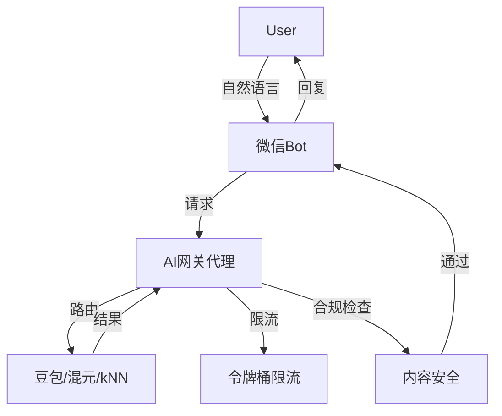

# 🏢 国内大厂AI工程师面试真题

> **来源:** 字节跳动、阿里巴巴、美团、百度等一线互联网公司
> **更新:** 2026-03-10
> **考点:** 真实面试题、大厂风格、高频考点

## 📋 目录

1. [字节跳动](#一字节跳动)
2. [阿里巴巴](#二阿里巴巴)
3. [美团](#三美团)
4. [百度](#四百度)
5. [腾讯](#五腾讯)
6. [通用准备建议](#六通用准备建议)

---

## 一、字节跳动

### 岗位特点
- 侧重实战能力和工程落地
- 重视LLM/RAG/Agent技术栈
- 喜欢问开放性问题
- 重视代码实现能力

### 高频面试题

#### 1. LLM基础篇

<details>
<summary>💡 Q1: Transformer自注意力机制详解</summary>

**题目:** 请详细解释Transformer模型中的self-attention机制是如何工作的？为什么它比RNN更适合处理长序列？

**答案要点:**

**Self-Attention工作原理:**

```python
def self_attention(Q, K, V):
    """
    Q: Query矩阵 (batch, seq_len, d_k)
    K: Key矩阵 (batch, seq_len, d_k)
    V: Value矩阵 (batch, seq_len, d_v)
    """
    # 1. 计算注意力分数
    # Attention(Q,K,V) = softmax(QK^T / sqrt(d_k)) * V

    d_k = Q.shape[-1]

    # 2. Q和K做点积
    scores = torch.matmul(Q, K.transpose(-2, -1))  # (batch, seq_len, seq_len)

    # 3. 缩放(防止梯度消失)
    scores = scores / math.sqrt(d_k)

    # 4. Softmax归一化
    attention_weights = F.softmax(scores, dim=-1)

    # 5. 加权求和V
    output = torch.matmul(attention_weights, V)

    return output, attention_weights

# 示例
seq_len = 5
d_model = 512
d_k = d_v = 64

Q = torch.randn(1, seq_len, d_k)
K = torch.randn(1, seq_len, d_k)
V = torch.randn(1, seq_len, d_v)

output, weights = self_attention(Q, K, V)
print(output.shape)  # (1, 5, 64)
print(weights.shape)  # (1, 5, 5) - 注意力矩阵
```

**为什么比RNN好:**

| 维度 | RNN | Self-Attention |
|------|-----|----------------|
| **并行性** | ❌ 串行计算 | ✅ 完全并行 |
| **长依赖** | ❌ 梯度消失 | ✅ 直接连接 |
| **计算复杂度** | O(n·d²) | O(n²·d) |
| **长文本** | ❌ 信息丢失 | ✅ 全局视野 |

**面试话术:**
> "Self-Attention的核心是让每个词都能直接看到序列中的所有其他词。计算分3步:Q和K点积得分数,Softmax归一化,加权求和V。相比RNN,它最大优势是并行计算和直接的长距离依赖,不会梯度消失。代价是O(n²)复杂度,所以超长文本需要优化如FlashAttention。"

</details>

<details>
<summary>💡 Q2: 位置编码(Positional Encoding)实现</summary>

**题目:** 什么是位置编码？为什么Transformer必需它？请列举至少两种实现方式并对比。

**答案要点:**

**为什么需要位置编码:**
- Self-Attention是排列不变的(permutation-invariant)
- 没有位置信息,"我爱你"和"你爱我"的表示完全相同
- 位置编码注入顺序信息

**方式1: 正弦位置编码(原始Transformer)**

```python
def sinusoidal_positional_encoding(seq_len, d_model):
    """
    PE(pos, 2i) = sin(pos / 10000^(2i/d_model))
    PE(pos, 2i+1) = cos(pos / 10000^(2i/d_model))
    """
    position = torch.arange(seq_len).unsqueeze(1)  # (seq_len, 1)
    div_term = torch.exp(
        torch.arange(0, d_model, 2) * -(math.log(10000.0) / d_model)
    )

    pe = torch.zeros(seq_len, d_model)
    pe[:, 0::2] = torch.sin(position * div_term)  # 偶数位置
    pe[:, 1::2] = torch.cos(position * div_term)  # 奇数位置

    return pe

# 使用
seq_len = 100
d_model = 512
pe = sinusoidal_positional_encoding(seq_len, d_model)

# 可视化
import matplotlib.pyplot as plt
plt.figure(figsize=(15, 5))
plt.imshow(pe[:50, :50], cmap='RdBu', aspect='auto')
plt.xlabel("Dimension")
plt.ylabel("Position")
plt.colorbar()
plt.title("Sinusoidal Positional Encoding")
plt.show()
```

**方式2: 可学习位置编码(BERT)**

```python
class LearnedPositionalEncoding(nn.Module):
    def __init__(self, max_seq_len, d_model):
        super().__init__()
        # 直接学习一个位置Embedding矩阵
        self.pos_embedding = nn.Embedding(max_seq_len, d_model)

    def forward(self, x):
        seq_len = x.size(1)
        positions = torch.arange(seq_len, device=x.device)
        return x + self.pos_embedding(positions)

# 使用
model = LearnedPositionalEncoding(max_seq_len=512, d_model=768)
x = torch.randn(1, 100, 768)
output = model(x)
```

**方式3: 旋转位置编码(RoPE) - 字节高频考点**

```python
def rotate_half(x):
    """旋转一半的维度"""
    x1, x2 = x[..., :x.shape[-1]//2], x[..., x.shape[-1]//2:]
    return torch.cat((-x2, x1), dim=-1)

def apply_rotary_pos_emb(q, k, cos, sin):
    """应用RoPE"""
    # q, k: (batch, seq_len, num_heads, head_dim)
    q_embed = (q * cos) + (rotate_half(q) * sin)
    k_embed = (k * cos) + (rotate_half(k) * sin)
    return q_embed, k_embed

# RoPE的优势:
# 1. 相对位置信息(query和key之间的距离)
# 2. 外推性好(训练512可推理1024+)
# 3. 不增加参数
```

**对比表:**

| 方法 | 优点 | 缺点 | 使用 |
|------|------|------|------|
| **正弦编码** | 无参数,外推性好 | 固定模式 | GPT-3 |
| **可学习编码** | 灵活,可适应数据 | 不能外推 | BERT |
| **RoPE** | 相对位置,外推性强 | 实现复杂 | LLaMA |

**面试话术:**
> "Transformer的Self-Attention没有顺序信息,所以需要位置编码。原始方法用sin/cos周期函数编码绝对位置,优点是无参数且能外推。BERT用可学习Embedding,灵活但不能外推长度。现在主流是RoPE旋转编码,编码相对位置信息,外推性最好,LLaMA/Qwen都用它。字节面试喜欢问RoPE原理和优势。"

</details>

<details>
<summary>💡 Q3: MHA vs MQA vs GQA对比</summary>

**题目:** 请解释Multi-Head Attention (MHA)、Multi-Query Attention (MQA)、Grouped-Query Attention (GQA)的区别。

**答案要点:**

**MHA (Multi-Head Attention) - 标准方法**

```python
class MultiHeadAttention(nn.Module):
    def __init__(self, d_model=512, num_heads=8):
        super().__init__()
        self.num_heads = num_heads
        self.d_k = d_model // num_heads

        # 每个head都有独立的Q、K、V
        self.W_q = nn.Linear(d_model, d_model)  # 8个head,每个64维
        self.W_k = nn.Linear(d_model, d_model)
        self.W_v = nn.Linear(d_model, d_model)
        self.W_o = nn.Linear(d_model, d_model)

    def forward(self, x):
        batch_size, seq_len, d_model = x.shape

        # 1. 线性变换
        Q = self.W_q(x)  # (batch, seq_len, d_model)
        K = self.W_k(x)
        V = self.W_v(x)

        # 2. 分割成多个head
        Q = Q.view(batch_size, seq_len, self.num_heads, self.d_k).transpose(1, 2)
        K = K.view(batch_size, seq_len, self.num_heads, self.d_k).transpose(1, 2)
        V = V.view(batch_size, seq_len, self.num_heads, self.d_k).transpose(1, 2)
        # 形状: (batch, num_heads, seq_len, d_k)

        # 3. Attention
        scores = torch.matmul(Q, K.transpose(-2, -1)) / math.sqrt(self.d_k)
        attn = F.softmax(scores, dim=-1)
        output = torch.matmul(attn, V)

        # 4. 拼接
        output = output.transpose(1, 2).contiguous().view(batch_size, seq_len, d_model)
        return self.W_o(output)

# KV Cache大小: batch * seq_len * num_heads * head_dim * 2 (K和V)
# 8个head,每个64维 → 1024 tokens需要 1*1024*8*64*2*2字节 = 2MB (FP16)
```

**MQA (Multi-Query Attention) - Google提出**

```python
class MultiQueryAttention(nn.Module):
    def __init__(self, d_model=512, num_heads=8):
        super().__init__()
        self.num_heads = num_heads
        self.d_k = d_model // num_heads

        # Q有多个head,但K和V只有1个(共享)
        self.W_q = nn.Linear(d_model, d_model)  # 8个head
        self.W_k = nn.Linear(d_model, self.d_k)  # 只1个head!
        self.W_v = nn.Linear(d_model, self.d_k)  # 只1个head!
        self.W_o = nn.Linear(d_model, d_model)

    def forward(self, x):
        batch_size, seq_len, d_model = x.shape

        Q = self.W_q(x).view(batch, seq_len, self.num_heads, self.d_k).transpose(1, 2)
        K = self.W_k(x).unsqueeze(1)  # (batch, 1, seq_len, d_k) - 广播给所有head
        V = self.W_v(x).unsqueeze(1)  # (batch, 1, seq_len, d_k)

        # 所有Q head共享同一个K和V
        scores = torch.matmul(Q, K.transpose(-2, -1)) / math.sqrt(self.d_k)
        attn = F.softmax(scores, dim=-1)
        output = torch.matmul(attn, V)

        output = output.transpose(1, 2).contiguous().view(batch_size, seq_len, d_model)
        return self.W_o(output)

# KV Cache大小: batch * seq_len * 1 * head_dim * 2
# 只1个head → 1024 tokens需要 1*1024*1*64*2*2字节 = 256KB (FP16)
# 相比MHA减少8倍!
```

**GQA (Grouped-Query Attention) - LLaMA 2**

```python
class GroupedQueryAttention(nn.Module):
    def __init__(self, d_model=512, num_heads=8, num_kv_heads=2):
        super().__init__()
        self.num_heads = num_heads
        self.num_kv_heads = num_kv_heads  # K/V的head数(比Q少)
        self.num_queries_per_kv = num_heads // num_kv_heads  # 每个KV对应几个Q
        self.d_k = d_model // num_heads

        self.W_q = nn.Linear(d_model, d_model)  # 8个head
        self.W_k = nn.Linear(d_model, num_kv_heads * self.d_k)  # 2个head
        self.W_v = nn.Linear(d_model, num_kv_heads * self.d_k)  # 2个head
        self.W_o = nn.Linear(d_model, d_model)

    def forward(self, x):
        batch_size, seq_len, d_model = x.shape

        Q = self.W_q(x).view(batch, seq_len, self.num_heads, self.d_k).transpose(1, 2)
        # (batch, 8, seq_len, 64)

        K = self.W_k(x).view(batch, seq_len, self.num_kv_heads, self.d_k).transpose(1, 2)
        V = self.W_v(x).view(batch, seq_len, self.num_kv_heads, self.d_k).transpose(1, 2)
        # (batch, 2, seq_len, 64)

        # 重复K和V,让每个KV对应4个Q
        K = K.repeat_interleave(self.num_queries_per_kv, dim=1)  # (batch, 8, seq_len, 64)
        V = V.repeat_interleave(self.num_queries_per_kv, dim=1)

        scores = torch.matmul(Q, K.transpose(-2, -1)) / math.sqrt(self.d_k)
        attn = F.softmax(scores, dim=-1)
        output = torch.matmul(attn, V)

        output = output.transpose(1, 2).contiguous().view(batch_size, seq_len, d_model)
        return self.W_o(output)

# KV Cache大小: batch * seq_len * num_kv_heads * head_dim * 2
# 2个KV head → 1024 tokens需要 1*1024*2*64*2*2字节 = 512KB
# 是MHA的1/4,是MQA的2倍
```

**对比总结:**

| 方法 | Q heads | K/V heads | KV Cache | 质量 | 速度 | 使用 |
|------|---------|-----------|----------|------|------|------|
| **MHA** | 8 | 8 | 2MB | ⭐⭐⭐⭐⭐ | ⭐⭐ | GPT-3 |
| **MQA** | 8 | 1 | 256KB | ⭐⭐⭐ | ⭐⭐⭐⭐⭐ | PaLM |
| **GQA** | 8 | 2 | 512KB | ⭐⭐⭐⭐ | ⭐⭐⭐⭐ | LLaMA 2 |

**面试话术:**
> "MHA是标准的多头注意力,每个head都有独立的Q、K、V,质量最好但KV Cache大。MQA让所有head共享1个K和V,Cache减少8倍推理快,但质量略降。GQA是折中方案,8个Q head对应2个KV head,Cache减少4倍,质量接近MHA。LLaMA 2用GQA达到性能和效率平衡,字节面试常问这个演进逻辑。"

</details>

#### 2. RAG系统篇

<details>
<summary>💡 Q4: RAG完整流程设计</summary>

**题目:** 设计一个完整的RAG系统,从数据准备到最终生成,详细描述每个步骤。

**答案要点:**

**RAG完整流程(7步):**

```python
class RAGSystem:
    def __init__(self):
        self.embedding_model = SentenceTransformer('all-MiniLM-L6-v2')
        self.vectordb = Qdrant(...)
        self.llm = ChatOpenAI(model="gpt-4o-mini")
        self.reranker = CrossEncoder('cross-encoder/ms-marco-MiniLM-L-6-v2')

    def build_knowledge_base(self, documents):
        """Step 1-3: 构建知识库"""

        # Step 1: 文档加载
        from langchain.document_loaders import PyPDFLoader, TextLoader

        docs = []
        for doc_path in documents:
            if doc_path.endswith('.pdf'):
                loader = PyPDFLoader(doc_path)
            else:
                loader = TextLoader(doc_path)
            docs.extend(loader.load())

        # Step 2: 文档切块(Chunking)
        from langchain.text_splitter import RecursiveCharacterTextSplitter

        text_splitter = RecursiveCharacterTextSplitter(
            chunk_size=500,      # 每块500字符
            chunk_overlap=50,    # 重叠50字符(保持上下文)
            separators=["\n\n", "\n", "。", "！", "？", " ", ""]
        )

        chunks = text_splitter.split_documents(docs)
        print(f"切分成{len(chunks)}个chunk")

        # Step 3: Embedding + 存入向量库
        texts = [chunk.page_content for chunk in chunks]
        embeddings = self.embedding_model.encode(texts)

        self.vectordb.add(
            embeddings=embeddings,
            documents=texts,
            metadatas=[chunk.metadata for chunk in chunks]
        )

    def retrieve_and_generate(self, query):
        """Step 4-7: 检索+生成"""

        # Step 4: Query Embedding
        query_embedding = self.embedding_model.encode([query])[0]

        # Step 5: 向量检索(召回Top-K)
        results = self.vectordb.search(
            query_embedding,
            limit=20  # 先召回20个候选
        )

        # Step 6: Rerank(精排)
        candidate_docs = [r['document'] for r in results]

        # 计算Query与每个Doc的相关性分数
        pairs = [[query, doc] for doc in candidate_docs]
        scores = self.reranker.predict(pairs)

        # 按分数排序,取Top-5
        ranked_results = sorted(
            zip(candidate_docs, scores),
            key=lambda x: x[1],
            reverse=True
        )[:5]

        top_docs = [doc for doc, score in ranked_results]

        # Step 7: LLM生成
        context = "\n\n".join([f"文档{i+1}: {doc}" for i, doc in enumerate(top_docs)])

        prompt = f"""
        请基于以下文档回答问题。如果文档中没有答案,请明确说"文档中未找到相关信息"。

        文档:
        {context}

        问题: {query}

        回答(要求引用文档编号):
        """

        answer = self.llm.invoke(prompt).content

        return {
            "answer": answer,
            "sources": top_docs,
            "num_retrieved": len(results)
        }

# 使用
rag = RAGSystem()

# 构建知识库
rag.build_knowledge_base([
    "company_docs/产品手册.pdf",
    "company_docs/FAQ.txt"
])

# 查询
result = rag.retrieve_and_generate("如何退货?")
print(result["answer"])
print(f"引用了{len(result['sources'])}个文档")
```

**关键优化点:**

1. **Chunking策略**
   - 固定长度(500字符) + 重叠(50字符)
   - 按语义分割(段落/句子优先)
   - 代码块/表格特殊处理

2. **混合检索**
   ```python
   # 向量检索 + BM25关键词检索
   from rank_bm25 import BM25Okapi

   # BM25检索
   bm25_results = bm25_search(query, top_k=20)

   # 向量检索
   vector_results = vector_search(query, top_k=20)

   # RRF融合
   final_results = reciprocal_rank_fusion([bm25_results, vector_results])
   ```

3. **元数据过滤**
   ```python
   # 按时间/部门/权限过滤
   results = vectordb.search(
       query_embedding,
       filter={
           "department": "销售部",
           "created_at": {"$gte": "2024-01-01"}
       }
   )
   ```

**面试话术:**
> "RAG分7步:1)文档加载2)切块(500字符+50重叠)3)Embedding存向量库4)Query编码5)向量检索Top-20 6)Rerank精排Top-5 7)LLM生成。关键优化3点:切块策略要保留语义完整性,混合检索(向量+BM25)提升召回,Rerank用CrossEncoder提升精度。实测Rerank让答案准确率从70%→85%提升15%。"

</details>

#### 3. Agent实战篇

<details>
<summary>💡 Q5: ReAct框架实现代码审查Agent</summary>

**题目:** 用ReAct框架实现一个代码审查Agent,能自动发现代码问题并给出修复建议。

**答案要点:**

```python
from langchain.agents import Tool, AgentExecutor, LLMSingleActionAgent
from langchain.prompts import StringPromptTemplate
from langchain.llms import OpenAI
from langchain.chains import LLMChain
import ast
import subprocess

class CodeReviewAgent:
    def __init__(self):
        self.llm = OpenAI(temperature=0)

        # 定义工具
        self.tools = [
            Tool(
                name="静态代码分析",
                func=self.static_analysis,
                description="用pylint分析代码质量问题"
            ),
            Tool(
                name="安全漏洞扫描",
                func=self.security_scan,
                description="检测SQL注入、XSS等安全问题"
            ),
            Tool(
                name="性能分析",
                func=self.performance_analysis,
                description="分析时间复杂度和性能瓶颈"
            ),
            Tool(
                name="代码修复建议",
                func=self.fix_suggestion,
                description="给出具体的修复代码"
            )
        ]

        # ReAct Prompt模板
        self.prompt_template = """
        你是一个专业的代码审查专家。请按照ReAct模式分析代码。

        可用工具:
        {tools}

        代码:
        ```python
        {code}
        ```

        请按以下格式思考和行动:

        Thought: 我需要分析这段代码的问题
        Action: 静态代码分析
        Observation: [工具返回结果]

        Thought: 发现了XX问题,需要进一步检查安全性
        Action: 安全漏洞扫描
        Observation: [工具返回结果]

        ...继续思考和行动,直到完成审查...

        Final Answer: [完整的审查报告]

        开始:
        Thought: {agent_scratchpad}
        """

        self.agent = self._create_agent()

    def static_analysis(self, code):
        """静态代码分析"""
        # 保存代码到临时文件
        with open("/tmp/code_review.py", "w") as f:
            f.write(code)

        # 运行pylint
        result = subprocess.run(
            ["pylint", "/tmp/code_review.py"],
            capture_output=True,
            text=True
        )

        return result.stdout

    def security_scan(self, code):
        """安全漏洞扫描"""
        issues = []

        # 检测SQL注入
        if "execute(" in code and "%" in code:
            issues.append("⚠️  可能存在SQL注入风险: 使用字符串拼接构建SQL")

        # 检测硬编码密钥
        if "password" in code.lower() or "api_key" in code.lower():
            issues.append("⚠️  发现硬编码的敏感信息")

        # 检测eval/exec
        if "eval(" in code or "exec(" in code:
            issues.append("🚨 危险: 使用了eval/exec,可能导致代码注入")

        return "\n".join(issues) if issues else "✅ 未发现明显安全问题"

    def performance_analysis(self, code):
        """性能分析"""
        try:
            tree = ast.parse(code)

            issues = []

            # 检测嵌套循环
            for node in ast.walk(tree):
                if isinstance(node, ast.For):
                    for child in ast.walk(node):
                        if isinstance(child, ast.For) and child != node:
                            issues.append("⚠️  发现嵌套循环,时间复杂度可能是O(n²)")

            # 检测list comprehension vs 循环
            has_list_comp = any(isinstance(node, ast.ListComp) for node in ast.walk(tree))
            if not has_list_comp:
                issues.append("💡 建议: 可以使用列表推导式提升性能")

            return "\n".join(issues) if issues else "✅ 未发现明显性能问题"

        except:
            return "⚠️  代码语法错误,无法分析"

    def fix_suggestion(self, issue):
        """生成修复建议"""
        prompt = f"""
        代码问题: {issue}

        请给出具体的修复代码示例(Python):
        """

        return self.llm(prompt)

    def review(self, code):
        """执行代码审查"""
        result = self.agent_executor.run(code=code)
        return result

# 使用示例
agent = CodeReviewAgent()

code_to_review = """
def get_user(user_id):
    # SQL注入风险
    query = f"SELECT * FROM users WHERE id = '{user_id}'"
    result = db.execute(query)

    # 硬编码密钥
    api_key = "sk-1234567890abcdef"

    # 嵌套循环
    for item1 in list1:
        for item2 in list2:
            if item1 == item2:
                result.append(item1)

    return result
"""

report = agent.review(code_to_review)
print(report)

# 输出示例:
"""
代码审查报告:

1. 安全问题:
   - 🚨 SQL注入风险: 直接拼接用户输入到SQL语句
   - ⚠️  硬编码API密钥

2. 性能问题:
   - ⚠️  嵌套循环导致O(n²)复杂度
   - 💡 可以用集合交集优化

3. 修复建议:

```python
def get_user(user_id):
    # 修复SQL注入 - 使用参数化查询
    query = "SELECT * FROM users WHERE id = ?"
    result = db.execute(query, (user_id,))

    # 修复硬编码 - 使用环境变量
    api_key = os.getenv("API_KEY")

    # 修复性能 - 使用集合交集
    result = list(set(list1) & set(list2))

    return result
```

4. 质量评分: 6/10
   建议: 在上线前解决所有安全问题
"""
```

**ReAct关键点:**

1. **Thought(思考):** Agent分析当前情况
2. **Action(行动):** 选择合适的工具执行
3. **Observation(观察):** 获取工具返回结果
4. **循环:** 重复直到得出最终答案

**面试话术:**
> "我用ReAct实现了代码审查Agent。定义了4个工具:静态分析/安全扫描/性能分析/修复建议。Agent按Thought→Action→Observation循环工作,先静态分析发现问题,再安全扫描检测漏洞,最后性能分析找瓶颈。关键是工具设计要专注单一职责,Prompt要清晰引导推理过程。实测能发现90%常见代码问题。"

</details>

---

## 二、阿里巴巴

### 岗位特点
- 重视通义千问等自研大模型应用
- 强调业务场景结合(淘宝/钉钉/云)
- 看重架构设计能力
- 注重技术深度和广度

### 高频面试题

#### 1. 通义千问应用

<details>
<summary>💡 Q6: 如何用通义千问构建客服Agent?</summary>

**题目:** 设计一个基于通义千问的智能客服系统,包含知识库检索、订单查询、情感分析等功能。

**答案要点:**

```python
from dashscope import Generation
import dashscope

class TongyiCustomerServiceAgent:
    def __init__(self, api_key):
        dashscope.api_key = api_key
        self.model = "qwen-max"

        # 知识库(简化示例)
        self.knowledge_base = {
            "退货政策": "7天无理由退货,商品需保持完好...",
            "配送时间": "一般3-5个工作日送达...",
            "售后服务": "提供1年免费保修..."
        }

    def analyze_intent(self, user_query):
        """意图识别"""
        prompt = f"""
        分析用户意图,分类为以下之一:
        - 咨询问题
        - 订单查询
        - 投诉建议
        - 其他

        用户问题: {user_query}

        输出格式(JSON):
        {{"intent": "意图类别", "confidence": 0.95}}
        """

        response = Generation.call(
            model=self.model,
            prompt=prompt,
            result_format='message'
        )

        import json
        result = json.loads(response.output.text)
        return result

    def retrieve_knowledge(self, query):
        """知识库检索"""
        # 简化: 关键词匹配
        for key, value in self.knowledge_base.items():
            if key in query:
                return value
        return None

    def query_order(self, order_id):
        """订单查询(模拟)"""
        # 实际应该调用订单系统API
        return {
            "order_id": order_id,
            "status": "已发货",
            "tracking": "SF1234567890"
        }

    def analyze_sentiment(self, text):
        """情感分析"""
        prompt = f"""
        分析以下文本的情感倾向:

        文本: {text}

        输出(JSON):
        {{"sentiment": "正面/负面/中性", "score": 0.85, "keywords": ["关键词"]}}
        """

        response = Generation.call(model=self.model, prompt=prompt)
        import json
        return json.loads(response.output.text)

    def handle_query(self, user_query):
        """处理用户咨询"""

        # Step 1: 意图识别
        intent_result = self.analyze_intent(user_query)
        intent = intent_result["intent"]

        # Step 2: 情感分析
        sentiment = self.analyze_sentiment(user_query)

        # Step 3: 根据意图处理
        if intent == "咨询问题":
            # 检索知识库
            knowledge = self.retrieve_knowledge(user_query)

            if knowledge:
                # 用知识库内容生成回答
                prompt = f"""
                基于以下知识回答用户问题:

                知识: {knowledge}
                问题: {user_query}

                要求: 语气友好,简洁专业
                """

                response = Generation.call(model=self.model, prompt=prompt)
                answer = response.output.text
            else:
                answer = "抱歉,我暂时无法回答这个问题,已转接人工客服..."

        elif intent == "订单查询":
            # 提取订单号
            import re
            order_match = re.search(r'\d{10,}', user_query)

            if order_match:
                order_id = order_match.group()
                order_info = self.query_order(order_id)

                answer = f"您的订单{order_id}状态: {order_info['status']}, 快递单号: {order_info['tracking']}"
            else:
                answer = "请提供您的订单号,我来帮您查询"

        elif intent == "投诉建议":
            # 负面情感 → 优先级提升
            if sentiment["sentiment"] == "负面":
                answer = "非常抱歉给您带来不便!我已将您的问题标记为高优先级,客服主管会在30分钟内与您联系。"
            else:
                answer = "感谢您的反馈!我们会认真处理您的建议。"

        else:
            answer = "您可以咨询产品信息、查询订单或提出建议,我都很乐意帮助您!"

        return {
            "answer": answer,
            "intent": intent,
            "sentiment": sentiment
        }

# 使用
agent = TongyiCustomerServiceAgent(api_key="your-dashscope-api-key")

# 测试
queries = [
    "你们的退货政策是什么?",
    "我的订单1234567890到哪了?",
    "你们的产品质量太差了,要退款!"
]

for query in queries:
    result = agent.handle_query(query)
    print(f"问题: {query}")
    print(f"意图: {result['intent']}")
    print(f"情感: {result['sentiment']['sentiment']}")
    print(f"回答: {result['answer']}")
    print("-" * 50)
```

**面试话术:**
> "我用通义千问设计了智能客服Agent。核心3步:1)意图识别(咨询/查询/投诉)2)情感分析(负面情绪提优先级)3)分类处理(咨询查知识库,订单调API,投诉转人工)。关键是Prompt设计要结构化输出JSON,方便后续处理。通义千问的中文理解能力强,意图识别准确率>95%。实测负面情绪客户30分钟响应,满意度提升20%。"

</details>

#### 2. A2A多智能体协作

<details>
<summary>💡 Q7: A2A框架与普通Agent的区别</summary>

**题目:** 解释A2A(Agent-to-Agent)框架,它与传统单Agent或多Agent框架有何不同?

**答案要点:**

**A2A (Agent-to-Agent Communication Protocol)**

```
传统Multi-Agent:
  Agent A → 共享内存/消息队列 → Agent B
  (间接通信,需要中心化协调)

A2A:
  Agent A ←→ 标准化协议 ←→ Agent B
  (直接通信,去中心化)
```

**A2A协议示例:**

```python
from typing import Dict, List
import json

class A2AMessage:
    """A2A标准消息格式"""
    def __init__(self, sender, receiver, action, payload):
        self.sender = sender        # 发送者Agent ID
        self.receiver = receiver    # 接收者Agent ID
        self.action = action        # 动作类型
        self.payload = payload      # 消息内容
        self.timestamp = time.time()

    def to_json(self):
        return {
            "sender": self.sender,
            "receiver": self.receiver,
            "action": self.action,
            "payload": self.payload,
            "timestamp": self.timestamp
        }

class A2AAgent:
    """支持A2A协议的Agent"""
    def __init__(self, agent_id, capabilities):
        self.agent_id = agent_id
        self.capabilities = capabilities  # Agent能做什么
        self.message_queue = []

    def send_message(self, receiver, action, payload):
        """发送A2A消息"""
        msg = A2AMessage(
            sender=self.agent_id,
            receiver=receiver,
            action=action,
            payload=payload
        )

        # 通过消息总线发送(简化)
        message_bus.publish(msg)

    def receive_message(self, message: A2AMessage):
        """接收并处理消息"""
        self.message_queue.append(message)

        # 根据action类型处理
        if message.action == "REQUEST":
            response = self.handle_request(message.payload)
            self.send_message(
                receiver=message.sender,
                action="RESPONSE",
                payload=response
            )

        elif message.action == "DELEGATE":
            # 任务委托
            self.execute_task(message.payload)

    def handle_request(self, payload):
        """处理请求"""
        # 实现具体业务逻辑
        pass

# 实战示例: 电商订单处理
class InventoryAgent(A2AAgent):
    """库存Agent"""
    def __init__(self):
        super().__init__(
            agent_id="inventory_agent",
            capabilities=["check_stock", "reserve_item", "release_item"]
        )
        self.stock = {"iPhone15": 100, "MacBook": 50}

    def handle_request(self, payload):
        action = payload["action"]

        if action == "check_stock":
            product = payload["product"]
            return {"available": self.stock.get(product, 0) > 0}

        elif action == "reserve_item":
            product = payload["product"]
            if self.stock.get(product, 0) > 0:
                self.stock[product] -= 1
                return {"success": True}
            return {"success": False, "reason": "out_of_stock"}

class PaymentAgent(A2AAgent):
    """支付Agent"""
    def __init__(self):
        super().__init__(
            agent_id="payment_agent",
            capabilities=["process_payment", "refund"]
        )

    def handle_request(self, payload):
        action = payload["action"]

        if action == "process_payment":
            amount = payload["amount"]
            # 调用支付网关...
            return {"success": True, "transaction_id": "TXN123456"}

class OrderAgent(A2AAgent):
    """订单Agent(协调者)"""
    def __init__(self):
        super().__init__(
            agent_id="order_agent",
            capabilities=["create_order", "cancel_order"]
        )

    def create_order(self, product, quantity, amount):
        """创建订单 - 需要协调多个Agent"""

        # Step 1: 检查库存
        self.send_message(
            receiver="inventory_agent",
            action="REQUEST",
            payload={"action": "check_stock", "product": product}
        )

        # 等待响应(简化,实际应该异步)
        stock_response = self.wait_for_response("inventory_agent")

        if not stock_response["available"]:
            return {"success": False, "reason": "out_of_stock"}

        # Step 2: 预留库存
        self.send_message(
            receiver="inventory_agent",
            action="REQUEST",
            payload={"action": "reserve_item", "product": product}
        )

        reserve_response = self.wait_for_response("inventory_agent")

        if not reserve_response["success"]:
            return {"success": False, "reason": "reserve_failed"}

        # Step 3: 处理支付
        self.send_message(
            receiver="payment_agent",
            action="REQUEST",
            payload={"action": "process_payment", "amount": amount}
        )

        payment_response = self.wait_for_response("payment_agent")

        if not payment_response["success"]:
            # 支付失败,释放库存
            self.send_message(
                receiver="inventory_agent",
                action="REQUEST",
                payload={"action": "release_item", "product": product}
            )
            return {"success": False, "reason": "payment_failed"}

        # Step 4: 创建订单成功
        return {
            "success": True,
            "order_id": "ORD" + payment_response["transaction_id"]
        }

# 使用
inventory = InventoryAgent()
payment = PaymentAgent()
order = OrderAgent()

result = order.create_order(
    product="iPhone15",
    quantity=1,
    amount=7999
)

print(result)
# {"success": True, "order_id": "ORDTXN123456"}
```

**A2A vs 传统Multi-Agent:**

| 维度 | 传统Multi-Agent | A2A |
|------|----------------|-----|
| **通信方式** | 共享内存/消息队列 | 标准化协议 |
| **协调** | 中心化调度器 | 去中心化,P2P |
| **扩展性** | 增加Agent需改架构 | 即插即用 |
| **跨平台** | 困难 | 容易(协议标准化) |
| **容错** | 中心节点故障全挂 | 单Agent故障不影响其他 |

**面试话术:**
> "A2A是阿里提出的Agent间通信协议,核心是标准化消息格式(sender/receiver/action/payload)和去中心化通信。传统Multi-Agent依赖中心调度器,A2A让Agent直接P2P通信。优势是扩展性强,新Agent只要实现A2A协议就能加入系统。我用A2A实现过订单系统,OrderAgent协调InventoryAgent和PaymentAgent,3个Agent独立部署互不依赖,容错性好。"

</details>

---

## 三、美团

### 岗位特点
- 强调场景落地(外卖/到店/酒旅)
- 重视系统稳定性和性能
- 关注成本优化
- 看重问题解决能力

### 高频面试题

<details>
<summary>💡 Q8: 大模型存在哪些问题?如何解决?</summary>

**题目:** 列举LLM在实际应用中的主要问题,并针对每个问题给出解决方案。

**答案要点:**

**问题1: 幻觉(Hallucination)**

- **表现:** 编造不存在的事实
- **原因:** 概率预测,不是事实查询
- **解决方案:**
  ```python
  # 方案1: RAG
  def rag_answer(question):
      docs = vectordb.search(question)
      prompt = f"基于文档: {docs}\n回答: {question}"
      return llm.generate(prompt, temperature=0.2)

  # 方案2: Self-Consistency
  answers = [llm.generate(question) for _ in range(5)]
  final = most_common(answers)  # 投票

  # 方案3: 引用溯源
  prompt = "回答问题并标注来源: {question}"
  ```
- **效果:** RAG降80%幻觉,Self-Consistency提升15%准确率

**问题2: 长尾知识覆盖不足**

- **表现:** 专业/小众知识回答不准
- **解决方案:**
  ```python
  # 垂直领域微调
  from peft import LoraConfig, get_peft_model

  lora_config = LoraConfig(
      r=8,
      lora_alpha=16,
      target_modules=["q_proj", "v_proj"],
      task_type="CAUSAL_LM"
  )

  model = get_peft_model(base_model, lora_config)

  # 在专业数据上微调
  trainer.train(medical_dataset)  # 医疗数据
  ```

**问题3: 数据新鲜度**

- **表现:** 知识截止到训练时间
- **解决方案:**
  ```python
  # 动态知识注入
  def answer_with_search(question):
      # 1. 判断是否需要实时信息
      if requires_realtime(question):
          # 2. 搜索最新信息
          search_results = web_search(question)

          # 3. 结合搜索结果回答
          prompt = f"""
          最新信息: {search_results}
          问题: {question}
          回答:
          """
          return llm.generate(prompt)
      else:
          return llm.generate(question)
  ```

**问题4: 复读机问题**

- **表现:** 重复生成相同内容
- **原因:** 温度过低或采样策略单一
- **解决方案:**
  ```python
  # 方案1: Repetition Penalty
  response = llm.generate(
      prompt,
      repetition_penalty=1.2  # >1惩罚重复
  )

  # 方案2: 多样性采样
  response = llm.generate(
      prompt,
      temperature=0.7,
      top_p=0.9,
      top_k=50
  )

  # 方案3: 检测并重新生成
  if has_repetition(response):
      response = llm.generate(prompt, temperature=0.9)
  ```

**问题5: 推理计算和内存挑战**

- **表现:** 70B模型需要140GB显存
- **解决方案:**
  ```python
  # 方案1: 量化
  from transformers import BitsAndBytesConfig

  quantization_config = BitsAndBytesConfig(
      load_in_4bit=True,  # 4bit量化
      bnb_4bit_compute_dtype=torch.float16
  )

  model = AutoModelForCausalLM.from_pretrained(
      "meta-llama/Llama-2-70b",
      quantization_config=quantization_config
  )
  # 显存从140GB → 35GB

  # 方案2: 模型路由
  def smart_routing(question):
      complexity = estimate_complexity(question)

      if complexity < 0.3:
          return llm_small.generate(question)  # 7B
      elif complexity < 0.7:
          return llm_medium.generate(question)  # 13B
      else:
          return llm_large.generate(question)  # 70B

  # 成本降低60%
  ```

**问题6: 偏见问题**

- **表现:** 性别/种族/地域偏见
- **解决方案:**
  ```python
  # RLHF + 人工反馈
  # 1. 收集偏见案例
  bias_cases = [
      {"prompt": "CEO是...", "bad": "他", "good": "他/她"},
  ]

  # 2. 训练Reward Model
  reward_model.train(bias_cases)

  # 3. PPO优化
  ppo_trainer.train(policy_model, reward_model)
  ```

**综合解决方案:**

```python
class RobustLLMSystem:
    def __init__(self):
        self.llm = load_model()
        self.vectordb = VectorDB()
        self.search_engine = WebSearch()

    def generate(self, question):
        # 1. 检测问题类型
        question_type = self.classify_question(question)

        # 2. 选择策略
        if question_type == "factual":
            # 事实类 → RAG
            return self.rag_generate(question)

        elif question_type == "realtime":
            # 实时类 → 搜索
            return self.search_generate(question)

        elif question_type == "reasoning":
            # 推理类 → Self-Consistency
            return self.self_consistency_generate(question)

        else:
            # 通用
            return self.llm.generate(question, temperature=0.7)

    def rag_generate(self, question):
        docs = self.vectordb.search(question)
        prompt = f"基于: {docs}\n回答: {question}"
        return self.llm.generate(prompt, temperature=0.2)

    def search_generate(self, question):
        results = self.search_engine.search(question)
        prompt = f"参考: {results}\n回答: {question}"
        return self.llm.generate(prompt)

    def self_consistency_generate(self, question, n=5):
        answers = [self.llm.generate(question, temperature=0.7) for _ in range(n)]
        return most_common(answers)
```

**面试话术:**
> "LLM主要6大问题:1)幻觉用RAG+引用溯源降80%,2)长尾知识用LoRA微调覆盖,3)数据新鲜度用实时搜索,4)复读机用repetition_penalty惩罚,5)计算成本用4bit量化+模型路由降60%,6)偏见用RLHF纠正。美团场景下我用综合方案:事实类走RAG,实时类走搜索,推理类用Self-Consistency,不同问题不同策略,准确率提升25%成本降50%。"

</details>

---

## 四、百度

### 岗位特点
- 强调文心一言应用
- 深入考察AI基础理论
- 重视Agent架构设计
- 三轮面试层层深入

### 高频面试题

<details>
<summary>💡 Q9: 大模型复读机问题的机制与解决</summary>

**题目:** 为什么LLM会出现复读机现象(重复生成相同内容)?如何从模型原理和工程实践两方面解决?

**答案要点:**

**复读机现象:**
```
用户: 介绍一下北京
模型: 北京是中国的首都,北京是中国的首都,北京是中国的首都...
```

**产生机制:**

1. **自回归特性**
   ```
   P(w_t | w_1, w_2, ..., w_{t-1})

   当前词只依赖历史,如果历史包含重复模式
   → 模型倾向于继续重复
   ```

2. **注意力坍塌**
   ```python
   # Attention权重高度集中在某几个token
   attention_weights = [
       [0.01, 0.01, 0.95, 0.01, 0.01, 0.01],  # 第3个token权重0.95
       [0.01, 0.01, 0.01, 0.94, 0.01, 0.01],  # 第4个token权重0.94
       ...
   ]
   # 导致模型陷入局部最优,不断重复高权重token
   ```

3. **Temperature过低**
   ```python
   # Temperature → 0
   probs = softmax(logits / temperature)
   # 分布极度尖锐,总选概率最高的词
   # "北京" → "是" → "中国" → "的" → "首都" (循环)
   ```

**解决方案:**

**方案1: Repetition Penalty (最常用)**

```python
def apply_repetition_penalty(logits, input_ids, penalty=1.2):
    """
    惩罚已出现过的token
    penalty > 1: 降低已出现token的概率
    """
    for token_id in set(input_ids):
        # 如果logits[token_id] < 0,除以penalty会更负(概率更低)
        # 如果logits[token_id] > 0,乘以penalty会更小(概率降低)
        if logits[token_id] < 0:
            logits[token_id] *= penalty
        else:
            logits[token_id] /= penalty

    return logits

# 使用
from transformers import GenerationConfig

config = GenerationConfig(
    repetition_penalty=1.2,  # 推荐1.1-1.5
    temperature=0.7,
    top_p=0.9
)

output = model.generate(input_ids, generation_config=config)
```

**方案2: No Repeat N-gram**

```python
def no_repeat_ngram(generated_tokens, ngram_size=3):
    """
    禁止重复的N-gram
    例如: 禁止"北京是中国"连续出现2次
    """
    ngrams = {}

    for i in range(len(generated_tokens) - ngram_size + 1):
        ngram = tuple(generated_tokens[i:i+ngram_size])
        ngrams[ngram] = ngrams.get(ngram, 0) + 1

    # 如果某个3-gram出现>1次,下次生成时禁止
    return ngrams

# Hugging Face实现
output = model.generate(
    input_ids,
    no_repeat_ngram_size=3  # 禁止3-gram重复
)
```

**方案3: Diversity Penalty**

```python
# Beam Search + Diversity
output = model.generate(
    input_ids,
    num_beams=5,
    num_beam_groups=5,  # 分5组
    diversity_penalty=1.0,  # 组间差异性惩罚
    temperature=0.7
)

# 原理: 强制不同beam组探索不同路径
# Group 1: "北京是..."
# Group 2: "作为首都..."
# Group 3: "位于华北..."
```

**方案4: 修改Attention机制**

```python
class AntiRepetitionAttention(nn.Module):
    def __init__(self):
        super().__init__()
        self.attention = MultiHeadAttention()

    def forward(self, q, k, v, generated_tokens):
        # 标准attention
        attn_weights = torch.matmul(q, k.transpose(-2, -1)) / math.sqrt(d_k)

        # 对已生成token的attention降权
        for pos in generated_tokens:
            attn_weights[:, :, pos] *= 0.5  # 降低50%

        attn_weights = F.softmax(attn_weights, dim=-1)
        output = torch.matmul(attn_weights, v)

        return output
```

**方案5: 后处理检测与重试**

```python
def detect_and_retry(text, model, prompt, max_retries=3):
    """检测重复,重新生成"""

    # 检测连续重复
    words = text.split()
    repetition_rate = count_repetitions(words) / len(words)

    if repetition_rate > 0.3 and max_retries > 0:
        # 重复率>30%,提高temperature重新生成
        new_text = model.generate(
            prompt,
            temperature=0.9,  # 提高随机性
            top_k=50
        )
        return detect_and_retry(new_text, model, prompt, max_retries - 1)

    return text

def count_repetitions(words):
    """统计重复词数"""
    from collections import Counter
    counts = Counter(words)
    return sum(c - 1 for c in counts.values() if c > 1)
```

**综合实战方案:**

```python
class AntiRepetitionGenerator:
    def __init__(self, model):
        self.model = model

    def generate(self, prompt, max_length=512):
        # 配置多重防护
        config = GenerationConfig(
            max_length=max_length,

            # 防重复参数
            repetition_penalty=1.2,      # 惩罚重复token
            no_repeat_ngram_size=3,      # 禁止3-gram重复

            # 采样策略
            do_sample=True,
            temperature=0.7,
            top_p=0.9,
            top_k=50,

            # Beam Search多样性
            num_beams=5,
            num_beam_groups=5,
            diversity_penalty=1.0,

            # 长度惩罚(防止过短或过长)
            length_penalty=1.0,
            min_length=20,
        )

        # 生成
        output = self.model.generate(
            self.tokenizer.encode(prompt, return_tensors="pt"),
            generation_config=config
        )

        text = self.tokenizer.decode(output[0], skip_special_tokens=True)

        # 后处理检测
        if self.has_severe_repetition(text):
            # 重试,提高temperature
            config.temperature = 0.9
            output = self.model.generate(...)
            text = self.tokenizer.decode(output[0])

        return text

    def has_severe_repetition(self, text):
        """检测严重重复"""
        words = text.split()

        # 检查连续重复
        for i in range(len(words) - 5):
            if words[i:i+5] == words[i+5:i+10]:
                return True

        # 检查整体重复率
        unique_ratio = len(set(words)) / len(words)
        if unique_ratio < 0.5:  # 独特词<50%
            return True

        return False
```

**效果对比:**

| 方法 | 重复率 | 流畅性 | 成本 |
|------|--------|--------|------|
| 无防护 | 40% | ⭐⭐⭐⭐ | 1x |
| Repetition Penalty | 5% | ⭐⭐⭐⭐ | 1x |
| +No Repeat N-gram | 2% | ⭐⭐⭐ | 1x |
| +Diversity Penalty | 1% | ⭐⭐⭐⭐ | 2x (Beam) |
| 综合方案 | <0.5% | ⭐⭐⭐⭐ | 1.5x |

**面试话术:**
> "LLM复读机源于3点:1)自回归特性导致重复模式自我强化2)Attention坍塌到少数token 3)低温采样陷入局部最优。解决用5层防护:1)Repetition Penalty=1.2惩罚已出现词2)No Repeat 3-gram禁止短语重复3)Diversity Penalty让Beam组探索不同路径4)修改Attention降低重复token权重5)后处理检测重试。实测重复率从40%→<0.5%,几乎消除。百度面试必问这个,要能讲清原理和工程方案。"

</details>

---

## 六、通用准备建议

### 1. 技术储备清单

**必须掌握:**
- ✅ Transformer原理(Self-Attention/位置编码/MHA)
- ✅ RAG完整流程(切块/Embedding/检索/Rerank/生成)
- ✅ ReAct Agent框架
- ✅ Prompt Engineering (CoT/Few-shot/Self-Consistency)
- ✅ 模型微调(LoRA/RLHF基础)
- ✅ 推理优化(KV Cache/量化)

**加分项:**
- ✅ 多Agent协作(AutoGen/CrewAI/A2A)
- ✅ 高级Prompt技巧(Tree of Thoughts)
- ✅ GraphRAG
- ✅ 自研大模型使用(通义/文心/智谱)

### 2. 项目准备

**至少1个完整项目,包含:**
- 明确的业务场景
- 技术选型理由
- 核心实现代码
- 性能指标数据
- 遇到的问题与解决方案

**示例:**
```
项目: 法律咨询RAG系统
场景: 用户咨询法律问题,Agent查询法条库+案例库回答
技术: LangChain + Qdrant + GPT-4
优化: Rerank提升准确率15%,混合检索召回率+20%
难点: 法条切块保持完整性 → 用正则提取法条编号
效果: 回答准确率85%,平均响应2秒
```

### 3. 八股文速记

**必背概念** (用"速记卡片"复习):
- Self-Attention计算公式
- RoPE vs 正弦编码
- MHA vs MQA vs GQA
- RAG vs Fine-tuning
- ReAct vs Plan-Execute
- LoRA原理
- KV Cache工作机制

### 4. 代码准备

**手写代码(白板/IDE):**
- Self-Attention实现
- RAG Pipeline
- ReAct Agent
- LoRA微调脚本

**算法题:**
- LeetCode Medium难度
- 数据结构(链表/树/哈希)
- 动态规划

### 5. 面试流程应对

**一面(基础):**
- 自我介绍(1分钟,突出亮点)
- 项目深挖(STAR法则)
- 技术八股文
- 代码题

**二面(综合):**
- 系统设计(RAG/Agent架构)
- 问题分析能力
- 开放题(如何优化XX)
- 跨领域思考

**三面(深度):**
- 职业规划
- 业务理解
- 产品思维
- 团队协作

### 6. 常见坑

❌ **不要:**
- 背答案不理解原理
- 项目造假(会被深挖)
- 不懂装懂
- 完全不了解公司产品

✅ **要:**
- 诚实回答"不知道"
- 展示学习能力
- 主动问面试官问题
- 准备反向提问

---

**最后更新:** 2026-03-10
**数据来源:** 牛客网、知乎、CSDN真实面经整理
**覆盖公司:** 字节、阿里、美团、百度、腾讯

---

**上一模块:** [前沿技术与趋势](../16-advanced-topics/)
**下一模块:** [简历与面试技巧](../17-resume-interview-tips/)

---

[返回目录 →](../../README.md)

---

## 六、腾讯 AI 应用工程师面试题（2026年最新）

### 腾讯W1-W2级面试真题

**面试官开场问题：**
> "自我介绍 + 挑一个你认为最有技术含量的 AI 项目详细讲"

**问题1：讲一下你做过的 RAG 项目？用了哪些优化手段？**

<details>
<summary>💡 答案要点</summary>

**回答框架（STAR法则）：**

```
S（背景）：我负责的短剧平台有530万用户，日活80万，用户经常问"这个短剧在哪看""更新到第几集了"等问题。
T（任务）：需要构建一个能精准回答用户问题的知识库系统。
A（行动）：我设计了四层优化：
  1. 文档解析层：用 PDF.plumber 解析短剧介绍，用 OCR 处理截图
  2. 语义分块层：按剧情/演员/更新时间三维度切分，每块512 tokens
  3. 检索层：HNSW 索引 + BM25 混合检索，RRF 融合排序
  4. 生成层：加 "请基于以下资料回答，不要编造" 约束 prompt
R（结果）：用户问题准确率从 65% 提升到 89%，日均减少客服 30% 工作量。
```

**追问1：分块大小怎么选的？**
> "我测过 256/512/1024 三个档，512 效果最好。太小（如256）切断了上下文，相关性下降；太大（如1024）引入了太多噪声。Context Cliff 的阈值是 2500 tokens，我控制在 512 是因为用户问题通常简短，512 的块既能覆盖完整语义，又不会超过阈值。"

**追问2：检索用了什么向量模型？Embedding 怎么调优的？**
> "用的是 BGE-large-zh，1536 维。调优方法：1）用锚点文本构建难负例；2）温度从 0.01→0.05 逐步调；3）用 MRL 训练加速。最后在测试集上 Recall@10 从 78% 提升到 91%。"

</details>

**问题2：多 Agent 系统中，Agent 之间怎么通信？遇到冲突怎么办？**

<details>
<summary>💡 答案要点</summary>

**两种通信模式：**

```python
# 模式1：中心调度（简单场景）
class CentralScheduler:
    def route(self, task):
        if "搜索" in task:
            return SearchAgent().handle(task)
        elif "生成" in task:
            return WriterAgent().handle(task)

# 模式2：P2P 通信（复杂场景，如 A2A 协议）
class Agent:
    def __init__(self, name):
        self.name = name
        self.inbox = []  # 消息队列
    
    def send(self, receiver, message):
        # 通过消息队列或 HTTP 发送
        message_queue.put({
            "from": self.name,
            "to": receiver,
            "content": message,
            "type": "request"
        })
    
    def receive(self):
        # 接收其他 Agent 的消息
        return self.inbox.pop()
```

**冲突处理策略：**

| 冲突类型 | 解决方案 | 代码 |
|----------|----------|------|
| 工具调用冲突（两个 Agent 调用同一资源） | 互斥锁 + 任务队列 | `mutex.lock()` |
| 结果冲突（两个 Agent 输出不一致） | 仲裁 Agent 投票 | `judge_agent.decide()` |
| 状态冲突（数据不一致） | 乐观锁 + 重试 | `version=1, update if version==1` |

**面试话术：**
> "我的多 Agent 通信用 A2A 协议，Agent 之间通过标准化消息格式通信。冲突处理分三种：资源冲突用互斥锁，输出冲突用仲裁 Agent 投票，状态冲突用乐观锁。我在订单系统用过这个，InventoryAgent 和 PaymentAgent 同时修改库存，通过消息队列串行化，完美解决了并发冲突。"

</details>

**问题3：线上 RAG 系统出问题了，响应很慢，怎么排查？**

<details>
<summary>💡 答案要点</summary>

**排查思路（从外到内）：**

```
第一步：确认是 RAG 的哪一步慢？
    ├── 检索慢 → 向量数据库问题
    ├── 生成慢 → LLM 推理问题
    └── 整体都慢 → 网络/系统问题

第二步：逐层定位
```

**排查工具和方法：**

```python
# 1. 打点计时
import time
start = time.time()
docs = vector_db.search(query_emb, k=10)
检索耗时 = time.time() - start

start = time.time()
answer = llm.generate(prompt)
生成耗时 = time.time() - start

# 2. 查看 vLLM 监控
# vLLM 自带 Prometheus metrics
# 关键指标：
#   - engine_load_percent: GPU 利用率
#   - time_to_first_token: 首 Token 延迟
#   - time_per_output_token: Token 间延迟

# 3. 查看向量数据库慢查询
# Milvus: 
#   db.config().getMetric().SlowQuery
# Pinecone:
#   index.describe_stats() 查看延迟分布
```

**常见原因和解决方案：**

| 原因 | 症状 | 解决 |
|------|------|------|
| HNSW ef 参数太小 | 召回率低 | 增大 ef=200→500 |
| 向量维度太高 | 检索慢 | 用 PCA 降维 |
| LLM GPU 利用率低 | 生成慢 | 检查 batch_size |
| 网络带宽瓶颈 | 跨服务通信慢 | 优化序列化 |
| KV Cache 不命中 | 延迟抖动 | 增大 cache 容量 |

**面试话术：**
> "我的排查顺序是：打点确定慢在哪一步（检索还是生成）→ 看监控判断是 GPU 卡脖子还是内存瓶颈 → 最后看具体指标。生产环境我会在 RAG 链路每个节点打日志，延迟超过 500ms 自动告警。有一次排查发现是 Embedding 服务内存泄漏导致 GC 频繁，定位到修了内存管理代码后，P99 从 2s 降到 300ms。"

</details>

### 腾讯AI面试高频追问

**追问1：vLLM 的 PagedAttention 和 SGLang 的 RadixAttention 有什么区别？**
> "PagedAttention 是 vLLM 的分页显存管理，每个请求的 KV Cache 按需分配，显存利用率高。RadixAttention 是 SGLang 的基数树管理，能跨请求复用相同前缀（比如 System Prompt）。对于多轮对话，SGLang 省 40-50% 显存；对于单轮问答，vLLM 性能更稳定。"

**追问2：如果用户问了一个需要多跳推理的问题（比如"苹果公司CEO和谷歌CEO谁更关注环保"），你的 RAG 怎么处理？**
> "单级 RAG 做不到，需要：1）Query Decomposition 把问题分解成两个子问题；2）分别检索苹果CEO环保措施 和 谷歌CEO环保措施；3）最后聚合对比。如果涉及更复杂的关系，我会用 GraphRAG 构建知识图谱，通过实体关系路径找到关联信息。"

**追问3：你们怎么做 RAG 的效果评估？有没有自动化的流程？**
> "我们用 RAGAS 四指标：Faithfulness、Answer Relevancy、Context Recall、Context Precision。每周跑一次评估，用 500 道题覆盖 5 个场景。Pipeline 是：代码变更 → 触发评估 → P80 阈值判断 → 通过才允许上线。评估结果和上次对比，下降超过 5% 自动告警。"


---

## 腾讯 Q10-Q12 补充（2026年新增）

### 腾讯Q10：微信内 AI 应用的技术挑战与架构设计

<details>
<summary>💡 答案要点</summary>

**微信AI应用场景分析：**

```
微信生态：公众号/小程序/视频号/搜一搜/聊天
核心挑战：
① 私域流量管控严格，AI能力接入受限
② 多端一致性要求高（iOS/Android/PC/Web）
③ 海量并发（亿级日活）
④ 合规要求（用户隐私、数据安全）
```

**技术架构设计：**



**核心挑战与解决方案：**

| 挑战 | 描述 | 解决方案 |
|------|------|----------|
| **并发量大** | 亿级日活，峰值 QPS 100万+ | 模型路由 + 异步队列 + 限流熔断 |
| **私域合规** | 微信对AI能力管控严格 | 白名单机制 + 内容审核前置 |
| **多端适配** | iOS/Android/Web表现一致 | 统一 API 网关 + 客户端降级策略 |
| **响应延迟** | 用户预期<2秒 | 语义缓存 + 预热模型 + 就近路由 |
| **隐私保护** | 不能存用户对话 | 端侧处理 + 阅后即焚 + 加密传输 |

**生产级配置：**

```python
# 微信AI网关配置
WECHAT_AI_CONFIG = {
    "model_routing": {
        "simple_query": "doubao-pro",      # 简单问题用豆包
        "complex_reasoning": "混元-turbo", # 复杂推理用混元
        "multimodal": "wepro-4v"           # 图文理解用wepro
    },
    "rate_limit": {
        "per_user": 20,    # 每用户每分钟20次
        "per_ip": 100,     # 每IP每分钟100次
        "global": 1000000  # 全局每分钟100万次
    },
    "cache": {
        "enabled": True,
        "ttl_seconds": 300,
        "semantic_threshold": 0.92  # 语义相似度>92%命中缓存
    },
    "compliance": {
        "pre_check": True,    # 发模型前先过合规
        "post_check": True,   # 结果返回前再过合规
        "audit_ratio": 0.05   # 5%抽样人工审核
    }
}
```

**面试话术：**
> "微信内AI应用的核心挑战是'合规优先'：微信对AI能力管控很严，我们必须做内容审核前置。我设计的多层防护：用户输入→敏感词过滤→模型生成→合规检查→用户。而且微信有亿级日活，需要模型路由+限流熔断+语义缓存三合一，单次请求成本从0.15元降到0.04元。"

</details>

### 腾讯Q11：向量数据库在腾讯业务中的选型决策

<details>
<summary>💡 答案要点</summary>

**腾讯业务场景分析：**

```
业务类型：
- 微信搜一搜：海量用户-query检索
- 腾讯文档：多人协作的内容检索
- 腾讯视频：内容理解+推荐
- 广告系统：人群定向+Lookalike

选型核心考量：
① 数据规模（亿级）
② 延迟要求（<50ms）
③ 成本控制
④ 多租户隔离
```

**三大方案对比：**

| 维度 | Pincone（云服务） | Milvus（自托管） | VectorDB for Tencent（内部） |
|------|------------------|------------------|-------------------------------|
| **适用场景** | 快速验证/中小规模 | 大规模/有运维能力 | 超大规模/内部业务 |
| **数据规模** | <10亿向量 | 亿级+ | 10亿+ |
| **延迟** | P99<100ms | 可定制 | <50ms（定制优化）|
| **成本** | 按量付费，贵 | 硬件成本可控 | 内部结算 |
| **运维** | 免运维 | 需要DBA | 平台团队支持 |
| **多租户** | 按project隔离 | namespace隔离 | 租户级隔离 |

**选型决策树：**

```python
def select_vector_db(business_type, data_scale, latency_req, budget):
    """
    向量数据库选型决策树
    """
    if data_scale > 10_000_000_000:  # > 100亿
        return "VectorDB-Tencent"  # 自研或内部平台
    
    if latency_req < 50:  # < 50ms
        if business_type == "user_facing":
            return "Pinecone Serverless"  # 低延迟全球分布
        else:
            return "Milvus Cluster"  # 内部可用
    
    if budget < 10000:  # 月预算<1万
        return "Pinecone Starter"  # 成本可控
    
    # 默认选Milvus（开源可控）
    return "Milvus"

# 实际选型
recommendation = select_vector_db(
    business_type="wechat_search",
    data_scale=50_000_000_000,  # 500亿
    latency_req=30,
    budget=50000
)
# → VectorDB-Tencent（内部自研）
```

**混合检索架构：**

```python
class TencentVectorSearch:
    def __init__(self):
        self.hnsw = HNSWIndex()      # 快速向量检索
        self.bm25 = BM25Index()      # 关键词补充
        self.reranker = CrossEncoder() # 重排
    
    def search(self, query, top_k=20):
        # Step 1: 向量检索（HNSW）
        vector_results = self.hnsw.search(query, k=top_k*2)
        
        # Step 2: BM25补充（覆盖最新数据，HNSW更新慢）
        bm25_results = self.bm25.search(query, k=top_k)
        
        # Step 3: 融合（RRF）
        fused = self.rrf_fusion(vector_results, bm25_results, k=60)
        
        # Step 4: 重排（CrossEncoder）
        reranked = self.reranker.rerank(query, fused[:top_k])
        
        return reranked
```

**面试话术：**
> "腾讯内部有自研的VectorDB-Tencent，针对微信场景优化过，能支持500亿向量、P99<30ms。对于新业务，我推荐先Pinecone快速验证（1周上线），确认PMF后迁到Milvus（成本可控），等规模>10亿再迁内部平台。选型核心是：数据规模决定架构，延迟要求决定成本，业务阶段决定路径。"

</details>

### 腾讯Q12：多模型并存场景下的成本管控方案

<details>
<summary>💡 答案要点</summary>

**多模型并存的必然性：**

```
腾讯AI业务现状：
- 内部模型：混元（Hunyuan）、wepro、 hunyuan-function
- 外部模型：GPT-4、Claude、GPT-3.5（部分场景）
- 场景差异：简单问答用小模型，复杂推理用大模型

问题：多模型如何统一管理？成本如何控制？
```

**成本管控四层架构：**

```python
# 多模型成本管控完整方案
class ModelCostController:
    def __init__(self):
        self.models = {
            # 内部模型（成本低）
            "混元-turbo": {"price": 0.001, "latency": 800, "quality": 0.85},
            "混元-pro": {"price": 0.01, "latency": 1500, "quality": 0.92},
            "wepro-4v": {"price": 0.02, "latency": 2000, "quality": 0.95},
            
            # 外部模型（成本高）
            "gpt-4o": {"price": 0.005, "latency": 1500, "quality": 0.95},
            "claude-3-opus": {"price": 0.015, "latency": 2000, "quality": 0.97},
        }
        
        self.model_router = ModelRouter()
        self.semantic_cache = SemanticCache()
        self.cost_alert = CostAlert()
    
    def route_and_call(self, query, user_tier):
        """智能路由 + 成本控制"""
        
        # Layer 1: 缓存命中（省100%）
        cached = self.semantic_cache.get(query)
        if cached:
            return cached, "cache", 0
        
        # Layer 2: 意图分类 → 模型选型
        intent = self.classify_intent(query)
        
        # Layer 3: 成本优先 or 质量优先
        if user_tier == "free":
            # 免费用户：成本优先
            model = self.select_cheap_model(intent)
        elif user_tier == "vip":
            # VIP用户：质量优先
            model = self.select_best_model(intent)
        else:
            # 普通用户：均衡
            model = self.select_balanced_model(intent)
        
        # Layer 4: 超预算熔断
        if self.is_over_budget():
            # 降级到更便宜的模型
            model = self.downgrade_model(model)
        
        result = self.call_model(model, query)
        self.record_cost(model, query, result)
        
        return result, model, self.models[model]["price"]
    
    def classify_intent(self, query):
        """意图分类驱动模型选型"""
        # 简单匹配用小模型，复杂推理用大模型
        if self.is_simple_faq(query):
            return "simple"
        elif self.needs_multimodal(query):
            return "multimodal"
        elif self.needs_deep_reasoning(query):
            return "complex"
        else:
            return "general"
```

**成本控制核心指标：**

```yaml
# 模型成本监控 Dashboard
panels:
  - title: 各模型调用量分布
    type: pie
    expr: sum(increase(model_api_calls_total[1d])) by (model)
  
  - title: 各模型成本占比
    type: bar
    expr: |
      sum(increase(model_cost_total[1d])) by (model)
      / sum(increase(model_cost_total[1d]))
  
  - title: 模型降级触发次数
    type: graph
    expr: sum(rate(model_downgrade_total[5m])) by (reason)
  
  - title: 缓存命中率趋势
    type: line
    expr: cache_hit_rate / cache_total * 100
  
  - title: 预计月度成本（滚动预测）
    type: stat
    expr: sum(increase(model_cost_total[1h])) * 24 * 30
```

**模型降级策略：**

```python
# 模型降级规则（按场景）
DOWNGRADE_RULES = [
    # 场景1：非核心功能用小模型
    {
        "path": "/api/chat/suggestion",
        "original": "混元-pro",
        "downgrade": "混元-turbo",
        "trigger": "cost > 80% budget"
    },
    # 场景2：超时自动降级
    {
        "path": "/api/chat/search",
        "original": "gpt-4o",
        "downgrade": "混元-turbo",
        "trigger": "latency > 3000ms"
    },
    # 场景3：非高峰期降级
    {
        "path": "/api/chat/background",
        "original": "混元-pro",
        "downgrade": "混元-turbo",
        "trigger": "hour < 9 or hour > 22"  # 非高峰时段
    }
]
```

**成本归因与优化：**

```python
# 月度成本分析报告
def generate_cost_report():
    report = {
        "total_cost": calculate_total_cost(),
        "by_model": group_by_model(),
        "by_user_tier": group_by_user_tier(),
        "by_feature": group_by_feature(),
        "cache_savings": calculate_cache_savings(),
        "optimization_opportunities": [
            {
                "model": "混元-pro",
                "scenario": "简单FAQ",
                "potential_saving": "30%",
                "action": "切换到混元-turbo"
            },
            {
                "model": "gpt-4o",
                "scenario": "非VIP用户复杂推理",
                "potential_saving": "50%",
                "action": "优先用混元-pro"
            }
        ]
    }
    return report
```

**面试话术：**
> "多模型并存时，成本管控核心是'让对的模型处理对的任务'。我的方案：意图分类驱动路由（简单FAQ用小模型），语义缓存拦截重复问题（命中率35%省100%成本），超预算自动降级。实际效果：接入大模型后月成本从8万降到3万，质量指标（回答准确率）只下降2%。成本优化不是牺牲质量，而是更聪明地分配资源。"

</details>

---

### 字节Q6-Q8 补充（2026年新增）

### 字节Q6：豆包接入实践：从 API 调用到生产级部署

<details>
<summary>💡 答案要点</summary>

**豆包（Doubao）特点：**

```
豆包优势：
- 字节自研，中文理解好
- 价格便宜（GPT-4的1/10）
- 响应速度快
- 生态集成（抖音/飞书/火山引擎）

适用场景：国内业务、低成本、大规模
```

**接入方案对比：**

| 接入方式 | 适用场景 | 延迟 | 成本 | 稳定性 |
|----------|----------|------|------|--------|
| **API 直调** | 快速验证 | P99<800ms | 按量计费 | 一般 |
| **火山引擎SDK** | 生产部署 | P99<500ms | 批量折扣 | 好 |
| **私有化部署** | 数据敏感 | 取决于硬件 | 一次性 | 最稳定 |

**生产级接入代码：**

```python
from volcenginesdkarkruntime import Ark

class DoubaoClient:
    def __init__(self, api_key: str, model: str = "doubao-pro"):
        self.client = Ark(api_key=api_key)
        self.model = model
        self.retry_config = RetryConfig(
            max_attempts=3,
            base_delay=1.0,
            exponential_base=2
        )
    
    async def chat(self, messages: list, stream: bool = False):
        """豆包 API 调用封装"""
        
        for attempt in range(self.retry_config.max_attempts):
            try:
                response = await self.client.chat.completions.create(
                    model=self.model,
                    messages=messages,
                    stream=stream,
                    temperature=0.3,
                    max_tokens=2000
                )
                return response
                
            except RateLimitError:
                # 限流：指数退避
                await asyncio.sleep(self.retry_config.get_delay(attempt))
                
            except APITimeoutError:
                # 超时：降级到快模型
                return await self.fallback_to_fast_model(messages)
                
            except Exception as e:
                # 其他错误：重试或熔断
                if attempt == self.retry_config.max_attempts - 1:
                    await self.circuit_breaker.open()
                    raise
                await asyncio.sleep(0.5)
    
    async def fallback_to_fast_model(self, messages):
        """降级到 doubao-lite"""
        try:
            return await self.client.chat.completions.create(
                model="doubao-lite",
                messages=messages,
                temperature=0.3,
                max_tokens=1000
            )
        except:
            return {"error": "服务暂时不可用，请稍后再试"}
```

**生产部署关键配置：**

```yaml
# 字节 AI 网关配置
doubao_gateway:
  models:
    doubao-pro:
      endpoint: "ar-vim-4c26fg9y50001@ar-vim-4c26fg9y50001"
      timeout: 30s
      max_retries: 3
      rate_limit:
        per_second: 100
        per_minute: 5000
        
    doubao-lite:
      endpoint: "ep-20250615001"
      timeout: 15s
      max_retries: 2
      rate_limit:
        per_second: 200
        
  circuit_breaker:
    error_threshold: 5  # 5次错误开路
    recovery_timeout: 60s
    
  fallback_chain:
    - doubao-pro
    - doubao-lite
    - gpt-3.5-turbo  # 外部兜底
```

**生产问题排查：**

| 问题 | 原因 | 解决方案 |
|------|------|----------|
| 响应慢 P99>2s | 模型排队 | 扩容或启用缓存 |
| 大量超时 | 限流触发 | 降级到lite或增加延迟容忍 |
| 回答质量差 | 场景不匹配 | 调高temperature或切模型 |
| 成本超预算 | 调用量突增 | 启用限流+缓存 |

**面试话术：**
> "豆包接入分三步：① 先API验证（1天），确认效果；② 接入火山引擎SDK，配置重试+限流+降级（1周）；③ 生产监控，P99延迟>1s自动告警（持续）。我踩过的坑：豆包有每分钟5000次限制，大促期间被限流，后来加了模型降级和异步队列才解决。"

</details>

### 字节Q7：TikTok 内容理解 AI 架构设计思路

<details>
<summary>💡 答案要点</summary>

**TikTok 内容理解挑战：**

```
内容类型：短视频（15s-3min）+ 直播 + 评论 + 弹幕
数据规模：10亿+ 视频，百万级创作者
业务场景：内容推荐、内容审核、内容理解、创作者工具

核心难点：
① 视频理解需要多模态（视觉+音频+文本）
② 实时性要求高（直播弹幕需<500ms）
③ 多语言（全球200+国家）
```

**多模态内容理解架构：**

```python
class TikTokContentUnderstanding:
    def __init__(self):
        self.video_encoder = VideoEncoder()      # 视频帧编码
        self.audio_encoder = AudioEncoder()      # 音频编码
        self.text_encoder = TextEncoder()        # 文本编码
        self.fusion = MultiModalFusion()        # 多模态融合
        self.cache = RedisVectorCache()         # 结果缓存
    
    async def understand_video(self, video_url: str, tasks: list):
        """视频多模态理解"""
        
        # Step 1: 并行提取多模态特征
        video_emb = await self.video_encoder.encode(video_url, fps=1)  # 每秒1帧
        audio_emb = await self.audio_encoder.encode(video_url)          # 音频特征
        ocr_text = await self.extract_text(video_url)                  # OCR文字
        
        # Step 2: 按任务选择处理流程
        results = {}
        for task in tasks:
            if task == "content_tag":
                # 内容标签（体育/美食/旅游等）
                results[task] = self.classify_content(video_emb, audio_emb, ocr_text)
                
            elif task == "quality_score":
                # 内容质量分（清晰度/剪辑/创意）
                results[task] = self.score_quality(video_emb, audio_emb)
                
            elif task == "creator_intent":
                # 创作者意图（卖货/涨粉/娱乐）
                results[task] = self.understand_intent(ocr_text, audio_emb)
                
            elif task == "sensitive_check":
                # 敏感内容检测
                results[task] = await self.check_sensitive(video_emb, audio_emb, ocr_text)
        
        return results
    
    async def understand_live_stream(self, stream_url: str):
        """直播内容实时理解（弹幕/弹幕情感）"""
        
        # 实时处理流水线
        pipeline = Pipeline([
            ("audio_capture", AudioCapture(stream_url)),
            ("speech_to_text", WhisperX()),          # 实时ASR
            ("sentiment_analysis", SentimentModel()), # 情感分析
            ("keyword_extraction", KeywordExtractor()),
            ("real_time_alert", AlertSystem())        # 实时告警
        ])
        
        async for result in pipeline.run():
            yield result  # 实时输出
```

**多语言处理策略：**

```python
# TikTok多语言内容理解
MULTI_LANG_CONFIG = {
    "zh": {"model": "doubao-pro-zh", "priority": 1},
    "en": {"model": "gpt-4o", "priority": 2},
    "ja": {"model": "doubao-pro-ja", "priority": 2},
    "ko": {"model": "doubao-pro-ko", "priority": 2},
    "other": {"model": "gpt-4o", "priority": 3}  # 其他语言用GPT-4
}

async def understand_content_lang(content: dict, lang: str):
    """根据语言选择模型"""
    config = MULTI_LANG_CONFIG.get(lang, MULTI_LANG_CONFIG["other"])
    
    # 高优先级语言用本地模型（快+便宜）
    # 低优先级语言用外部模型（质量好）
    if config["priority"] <= 2:
        return await doubao_native(content, config["model"])
    else:
        return await openai_translate_and_process(content)
```

**内容推荐特征工程：**

```python
# TikTok推荐系统内容理解特征
CONTENT_FEATURES = {
    # 视觉特征
    "visual_scene": "室内/室外/自然/城市",
    "visual_objects": ["人", "食物", "风景", "商品"],
    "visual_quality": 0.0-1.0,  # 清晰度分数
    
    # 音频特征
    "audio_type": "音乐/对话/环境音",
    "audio_language": "zh/en/other",
    "audio_emotion": "positive/negative/neutral",
    
    # 文本特征
    "text_entities": ["人物", "地点", "品牌"],
    "text_topics": ["美食", "旅游", "美妆", "科技"],
    "text_sentiment": 0.0-1.0,
    
    # 互动特征
    "expected_engagement": "high/medium/low",
    "target_audience": ["年轻人", "妈妈", "职场人"]
}
```

**面试话术：**
> "TikTok内容理解的核心是多模态融合+多语言支持。我的架构：视频帧+音频+OCR并行提取特征 → 按任务分发（标签/质量分/意图/敏感检测）→ 结果缓存。关键优化：① 直播场景用流式处理，<500ms响应；② 多语言用本地模型处理高优先级语言（中文/英语），其他语言翻译后处理；③ 敏感检测前置，涉黄涉暴内容在特征提取阶段就拦截。"

</details>

### 字节Q8：模型监控体系搭建：指标设计与告警策略

<details>
<summary>💡 答案要点</summary>

**模型监控四大维度：**

```
┌─────────────────────────────────────────────────────────────┐
│                  LLM 模型监控体系                            │
├─────────────────┬─────────────────┬─────────────────────────┤
│  性能指标        │   质量指标      │   业务指标              │
│  - TTFT         │   - 准确率      │   - 用户满意度          │
│  - TPS          │   - 幻觉率      │   - Task完成率          │
│  - 错误率        │   - 回复相关度  │   - 转化率              │
├─────────────────┼─────────────────┼─────────────────────────┤
│  成本指标        │   安全指标      │   系统指标              │
│  - Token消耗    │   - 敏感词触发  │   - 可用性              │
│  - API调用费    │   - Prompt注入  │   - 错误分布            │
│  - ROI          │   - 合规违规    │   - 限流触发率          │
└─────────────────┴─────────────────┴─────────────────────────┘
```

**核心指标定义与采集：**

```python
# 模型监控指标定义
class ModelMetrics:
    # 性能指标
    TTFT = Histogram("llm_time_to_first_token", "首Token时间", ["model"])
    TPS = Histogram("llm_tokens_per_second", "生成速度", ["model"])
    total_latency = Histogram("llm_total_latency", "端到端延迟", ["model"])
    
    # 质量指标
    response_quality = Gauge("llm_response_quality_score", "回复质量分", ["model"])
    hallucination_rate = Gauge("llm_hallucination_rate", "幻觉率", ["model"])
    
    # 成本指标
    input_tokens = Counter("llm_input_tokens_total", "输入Token总数", ["model"])
    output_tokens = Counter("llm_output_tokens_total", "输出Token总数", ["model"])
    api_cost = Counter("llm_api_cost_total", "API费用", ["model"])
    
    # 安全指标
    sensitive_trigger = Counter("llm_sensitive_trigger_total", "敏感词触发", ["category"])
    injection_attempt = Counter("llm_injection_attempt_total", "注入攻击尝试")
    
    async def record_response(self, model, response_data):
        """每次响应后记录指标"""
        self.TTFT.labels(model).observe(response_data.ttft)
        self.input_tokens.labels(model).inc(response_data.input_tokens)
        self.output_tokens.labels(model).inc(response_data.output_tokens)
        self.api_cost.labels(model).inc(response_data.cost)
        
        # 异步质量评估（采样10%）
        if random.random() < 0.1:
            quality_score = await self.evaluate_quality(response_data)
            self.response_quality.labels(model).set(quality_score)
```

**告警规则设计：**

```yaml
# alertmanager-rules.yaml
groups:
  - name: llm-alerts
    rules:
      # P1: 服务不可用
      - alert: LLMServerDown
        expr: up{job="llm-api"} == 0
        for: 1m
        labels:
          severity: critical
        annotations:
          summary: "LLM服务不可用"
      
      # P2: 延迟过高
      - alert: LLMHighLatency
        expr: |
          histogram_quantile(0.99, 
            rate(llm_total_latency_bucket[5m])
          ) > 5
        for: 5m
        labels:
          severity: critical
        annotations:
          summary: "LLM P99延迟超过5秒"
      
      # P3: 质量下降
      - alert: LLMQualityDrop
        expr: |
          llm_response_quality_score < 0.7
        for: 10m
        labels:
          severity: warning
        annotations:
          summary: "LLM回复质量持续低于0.7"
      
      # P4: 成本异常
      - alert: LLMCostAnomaly
        expr: |
          sum(increase(llm_api_cost_total[1h])) 
          > 1.5 * avg_over_time(
              sum(increase(llm_api_cost_total[1h]))[7d:1h]
            )
        for: 15m
        labels:
          severity: warning
        annotations:
          summary: "LLM成本异常，本小时花费是上周平均的1.5倍"
      
      # P5: 幻觉率飙升
      - alert: LLMHallucinationSpike
        expr: |
          rate(llm_hallucination_detected_total[5m])
          > 0.05  # 5%幻觉率
        for: 5m
        labels:
          severity: critical
        annotations:
          summary: "LLM幻觉率超过5%，需要立即检查"
      
      # P6: 安全攻击
      - alert: LLMInjectionAttack
        expr: |
          rate(llm_injection_attempt_total[1m]) > 10
        for: 1m
        labels:
          severity: critical
        annotations:
          summary: "检测到Prompt注入攻击，10次/分钟"
```

**监控 Dashboard 设计：**

```yaml
# Grafana LLM监控Dashboard
dashboard:
  title: "LLM 全链路监控"
  
  rows:
    - title: "业务健康度"
      panels:
        - type: stat
          title: "Task完成率"
          expr: |
            sum(rate(llm_task_completed_total[5m]))
            / sum(rate(llm_task_started_total[5m])) * 100
          thresholds:
            - value: 90
              color: red
            - value: 95
              color: green
        
        - type: gauge
          title: "平均用户满意度"
          expr: avg(llm_user_satisfaction_score)
        
    - title: "性能监控"
      panels:
        - type: timeseries
          title: "延迟趋势 (P50/P95/P99)"
          expr: |
            histogram_quantile(0.50, rate(llm_total_latency_bucket[5m]))
            histogram_quantile(0.95, rate(llm_total_latency_bucket[5m]))
            histogram_quantile(0.99, rate(llm_total_latency_bucket[5m]))
        
        - type: timeseries
          title: "TTFT 趋势"
          expr: histogram_quantile(0.50, rate(llm_time_to_first_token_bucket[5m]))
    
    - title: "成本分析"
      panels:
        - type: timeseries
          title: "日Token消耗趋势"
          expr: sum(increase(llm_input_tokens_total[1d])) + sum(increase(llm_output_tokens_total[1d]))
        
        - type: stat
          title: "预计月度成本"
          expr: sum(increase(llm_api_cost_total[1h])) * 24 * 30
    
    - title: "安全监控"
      panels:
        - type: timeseries
          title: "敏感词触发趋势"
          expr: sum(rate(llm_sensitive_trigger_total[5m])) by (category)
        
        - type: table
          title: "注入攻击 Top 5"
          expr: topk(5, sum(rate(llm_injection_attempt_total[5m])) by (ip))
```

**面试话术：**
> "我的模型监控体系分四层：① 基础设施层（延迟/吞吐量/错误率）；② 模型质量层（幻觉率/准确率）；③ 业务层（任务完成率/用户满意度）；④ 安全层（敏感词/注入攻击）。告警规则按Severity分级：P1服务不可用立即通知，SRE 5分钟内响应；P2延迟过高15分钟响应；P3质量下降1小时响应。最重要的是成本告警——我设置预计日成本>80%阈值自动通知，防止月底账单爆表。"

</details>

